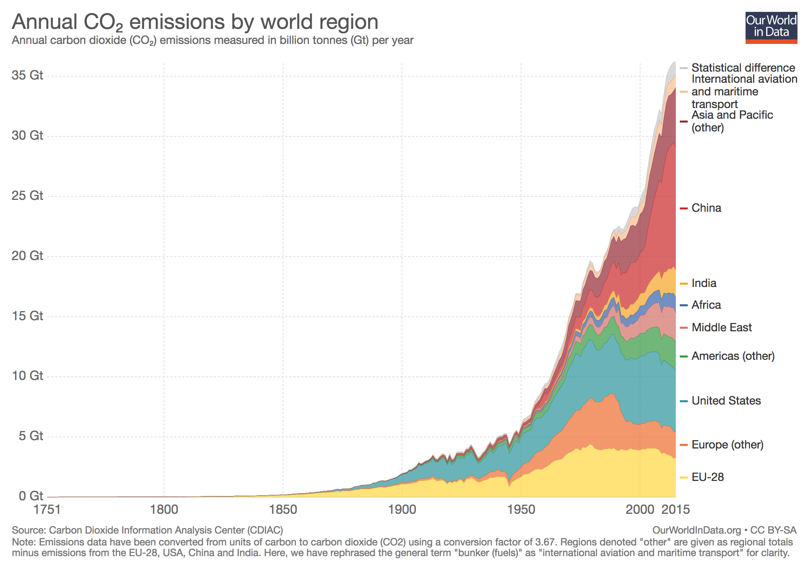

```{r setup, include=FALSE}
rm(list = ls())
knitr::opts_chunk$set(echo = TRUE)
```


# Exercise 1: `ggplot`

The following url:
"http://cdiac.ess-dive.lbl.gov/ftp/ndp030/CSV-FILES/nation.1751_2014.csv"
contains data on fossil fuel emissions.

a. Read data to R. Note that rows 1-3 contain information on the dataset itself.
Delete these rows as they do not contain relevant information.

```{r}
emissions <- read.csv("http://cdiac.ess-dive.lbl.gov/ftp/ndp030/CSV-FILES/nation.1751_2014.csv")
emissions <- emissions[4:nrow(emissions), ]
head(emissions)
```

b. Compute the total yearly $CO_2$ emissions (column "Total.CO2.emissions.from.fossil.fuels.and.cement.production..thousand.metric.tons.of.C.") 
summed over all countries (the world total $CO_2$ emission). 
You can use a forloop over "years" or `dplyr` functions.

```{r message=FALSE, warning = FALSE}
library(dplyr)
emissionsTotal <- emissions %>% 
  group_by(Year) %>%
  summarise(
    world_total = 
      sum(Total.CO2.emissions.from.fossil.fuels.and.cement.production..thousand.metric.tons.of.C.))
```


c. Plot the world (summed over all countries) $CO_2$ emission over time in 
billion tonnes (Gt) per year, i.e. divide the quantity
computed in (b) by 10^6. You can use a line or a scatter plot.

```{r message=FALSE, warning = FALSE}
library(ggplot2)
ggplot(emissionsTotal, aes(x = Year, y = world_total/10^6)) +
  geom_line() + theme_bw()
```

d. Now read the dataset located at "https://raw.githubusercontent.com/lukes/ISO-3166-Countries-with-Regional-Codes/master/all/all.csv" which contains an assignment of countries to regions. Merge emissions
dataset to the countries dataset. Note that in emissions dataset countries are
given with all caps, but not in countries dataset. You need to change that before
merging the two tables. Hint: use the function `toupper()`. Add a column
'co2_emission' equal to $CO_2$ emission in Gt, i.e. 
'Total.CO2.emissions.from.fossil.fuels.and.cement.production..thousand.metric.tons.of.C.'/10^6

```{r}
countries <- read.csv("https://raw.githubusercontent.com/lukes/ISO-3166-Countries-with-Regional-Codes/master/all/all.csv")
countries$name <- toupper(countries$name)
head(countries)

```

```{r}
df <- emissions %>% 
  left_join(countries, by = c("Nation" = "name")) %>%
  mutate(co2_emission = Total.CO2.emissions.from.fossil.fuels.and.cement.production..thousand.metric.tons.of.C./10^6)
head(df)
```

e. Use `dplyr` to compute total annual $CO_2$ ('co2_emission') 
emission per 'sub.region'.


```{r}
df <- df %>%
  group_by(Year, sub.region) %>%
  summarise(co2_emission = sum(co2_emission))
head(df)
```


f. Use `ggplot` to generate a stacked density plot the annual $CO_2$ 
(in giga tonnes) by world regions ("sub.region").
Your plot should resemble something like this (but with other regional 
categories, and slightly different values). Hint: use `geom_area()`
function with suitable parameters. 




```{r}
ggplot(df, aes(fill = sub.region, x = Year, y = co2_emission)) +
  geom_area(stat = "identity") +
  theme(legend.position = "bottom")
```


# Exercise 2: Gene expression data

In this exercise we will use the DNA microarray gene expression data.
You can read more about it on page 5 of ["The Elements of Statistical Learning"](https://web.stanford.edu/~hastie/Papers/ESLII.pdf).

```{r}
microarray <- read.table("https://web.stanford.edu/~hastie/ElemStatLearn/datasets/nci.data")
info <- read.table("https://web.stanford.edu/~hastie/ElemStatLearn/datasets/nci.info.txt",
                   skip = 12)
colnames(microarray) <- info$V1
microarray[1:5, 1:5]
```

In the 'microarray' matrix columns correspond to samples, and rows to genes.

a. Randomly subset microarray to 500 genes. Then, plot a heatmap without
clustering/dendrograms. You can use 'asp = 0.2' argument to change the aspect
ratio of the heatmap.

```{r, fig.width=5, fig.height=6}
set.seed(123456)
idx <- sample(1:500)
heatmap(as.matrix(microarray)[idx, ], Rowv = NA, Colv = NA, asp=0.2)
```

b. Plot the previous heatmap with red/green color scheme. For your convenience
here is the color vector you might like to use:
```{r }
redgreen <- c("#FF0000", "#DB0000", "#B60000", "#920000", "#6D0000",
              "#490000", "#240000", "#000000", "#002400", "#004900",
              "#006D00", "#009200", "#00B600", "#00DB00", "#00FF00")
```


```{r fig.width=5, fig.height=6}
heatmap(as.matrix(microarray)[idx, ], Rowv = NA, Colv = NA, asp=0.2, col = redgreen)
```

Now, plot the same graph but with dendrogram for rows (rows clustering).

```{r fig.width=5, fig.height=6}
heatmap(as.matrix(microarray)[idx, ], Colv = NA, asp=0.2, col = redgreen)
```

d. Now instead of base heatmap, use interactive `heatmaply()` to generate the 
previous plot. You might want to add a command similar to the following 
` %>% layout(margin = list(l = 150, b = 350), autosize = F, width = 600, height = 800)`
to the plot to set margins and to resize it. 

```{r, message=FALSE, warning = FALSE}
library(heatmaply)
heatmaply(data.frame(microarray[idx, ]), Colv = FALSE, colors = redgreen) %>%
  layout(margin = list(l = 150, b = 350), autosize = F, width = 600, height = 800)
```


e. What interesting patterns do you observe? Are there
some differences between conditions? Are some genes up down regulated
for certain groups? No need for long answers just look at the heatmap
state what you see.


# Exercise 3: Hypothesis testing

Recall the movies data-frame we used in for lecture 3 exercises. It contains
information on movies from the last three decates, which was scrapped from
the IMDB database.

```{r}
url <- "https://raw.githubusercontent.com/Juanets/movie-stats/master/movies.csv"
movies <- tbl_df(read.csv(url))
movies
```

a. Generate a boxplot of runtimes for action movies and commedies
with jittered points overlaid on top. You might consider setting collor, 
fill and alpha arguments to modify clarity and transparency of the plot.

```{r, fig.height=4, fig.width=4}
ggplot(movies %>% filter(genre %in% c("Action", "Comedy")), 
       aes(x = genre, y = runtime)) +
  geom_boxplot() +
  geom_jitter(height = 0,alpha = 0.2, color = "grey30") 
```

b. Test a hypothesis that the action movies have higher mean runtime (length)
than the comedies. Is the difference statistically greater than zero
at significance level $\alpha = 0.05$?

```{r}
t.test(formula = runtime ~ genre,
       data = movies %>% 
         filter(genre %in% c("Action", "Comedy")), 
       alternative = "greater")
```


# Exercise 4: linear model

a. Read the data from "http://www-bcf.usc.edu/~gareth/ISL/Advertising.csv"
containing information on sales of a product and the amount spent on advertising
using different media channels.

```{r}
advertising <- read.csv("http://www-bcf.usc.edu/~gareth/ISL/Advertising.csv", 
                        row.names = 1)
head(advertising)
```

b. Generate a scatterplot of sales against the amount of TV advertising and 
add a linear fit line.

```{r}
ggplot(advertising, aes(x = TV, y = sales)) +
  geom_point() + geom_smooth(method = "lm")
```

c. Now make a 3D scatterplot with axes corresponding to 'sales', 'TV'
and 'radio'.

```{r}
library(plotly)
plot_ly(data = advertising, x = ~TV, y = ~radio, z = ~sales, 
        type = "scatter3d", mode = "markers", marker = list(size = 4))
```


d. The dataset has 200 rows. Divide it into a train set with 150 observations
and a test set with 50 observations, i.e. use `sample(1:200, n = 150)` to
randomly choose row indices of the advertising dataset to include in the 
train set. The remaining indices should be used for the test set. Remember
to choose and set the seed for randomization!

```{r}
set.seed(12345)
idx <- sample(1:nrow(advertising), 150)
train <- advertising[idx, ]
test <- advertising[-idx, ]
```


e. Fit a linear model to the training set, where the sales values are
predicted by the amount of TV advertising. Print the summary of the fitted model.
Then, predict the sales values for the test set and evaluate the test model 
accuracy in terms of mean squared error (MSE).

```{r}
fit1 <- lm(sales ~ TV, data  = train)
summary(fit1)
```

```{r}
yhat <- predict(fit1, test)
(mse1 <- mean((test$sales - yhat)^2))
```

f. Fit a multiple linerar regression model including all the variables 'TV',
'radio', 'newspaper' to model the 'sales' in the training set. Then, compute 
the predicted sales for the test set with the new model and evalued the MSE.  
Did the error decrease from the one correspodning to the previous model?

```{r}
fit2 <- lm(sales ~ TV + radio + newspaper, data  = train)
summary(fit2)
```

```{r}
yhat <- predict(fit2, test)
(mse2 <- mean((test$sales - yhat)^2))
```

g. Look at the summary output for the multiple regression model and note which 
of the coefficient in the model is significant. Are all of them significant?
If not refit the model including only the features found significant.
Which of the models should you choose? 

```{r}
fit3 <- lm(sales ~ TV + radio, data  = train)
summary(fit3)
```

```{r}
yhat <- predict(fit3, test)
(mse3 <- mean((test$sales - yhat)^2))
```


# Exercise 4: classification
Email spam ESL

# Exercise 5: clustering

# Exercise 6: `ggmap`

a. Plot housing market prices
b. Plot route to work

Fire smoke https://cran.r-project.org/web/packages/PWFSLSmoke/vignettes/Maps_and_Timeseries_Plots.html
Fire smoke https://cran.r-project.org/web/packages/PWFSLSmoke/vignettes/Data_Model.html

https://www.nceas.ucsb.edu/~frazier/RSpatialGuides/ggmap/ggmapCheatsheet.pdf

http://web.stanford.edu/~imalone/VAM/ggmap.html

http://eriqande.github.io/rep-res-web/lectures/making-maps-with-R.html

http://urbanspatialanalysis.com/dataviz-tutorial-mapping-san-francisco-home-prices-using-r/

https://takeout.google.com/settings/takeout


https://medium.com/@tejasrr19/visualize-your-google-location-history-a2343b14a6fe
https://shiring.github.io/maps/2016/12/30/Standortverlauf_post

https://www2.warwick.ac.uk/fac/sci/moac/people/students/peter_cock/r/heatmap/
