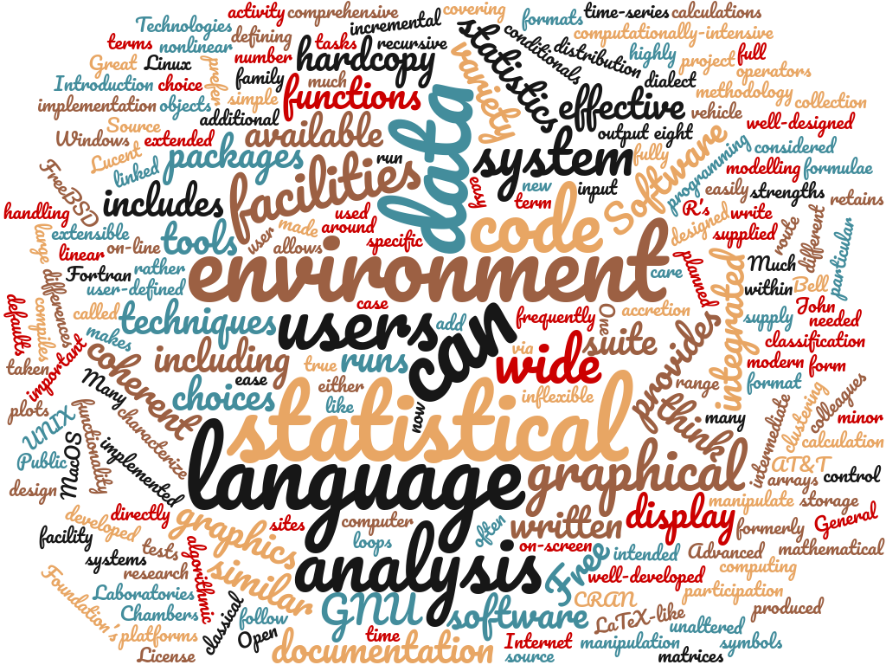
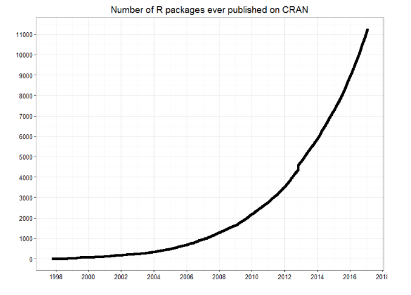
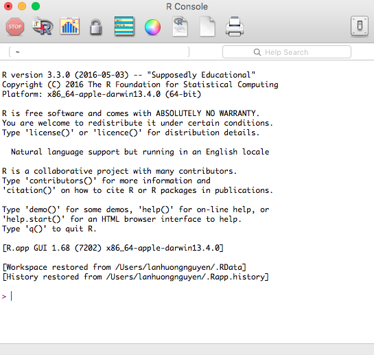
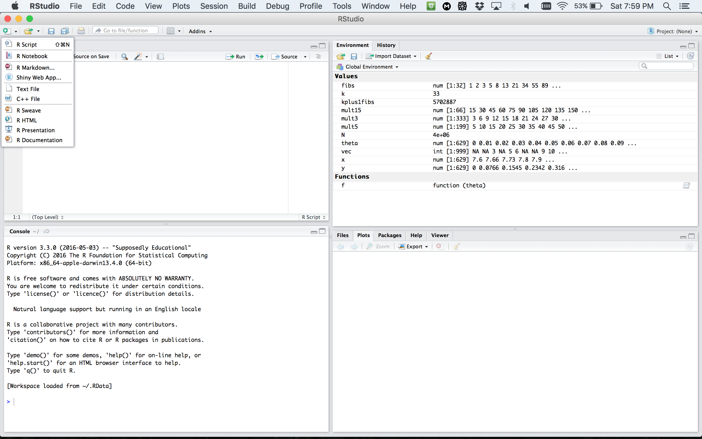

--- 
title: 'Lecture 1: Introduction to R'
subtitle: 'CME/STATS 195'
date: "September 27, 2018" 
author: "Lan Huong Nguyen"
output: 
  revealjs::revealjs_presentation:
    self_contained: false
    lib_dir: libs
    theme: simple
    hightlights: haddock
    smart: true
    center: true
    transition: slide
    css: cme195.css
    fig_width: 10
    fig_height: 6
    reveal_options:
      slideNumber: true
---

```{r global_options, echo = FALSE, include = FALSE}
options(width = 999)
knitr::opts_chunk$set(
  warning = FALSE, message = FALSE,
  cache = FALSE, tidy = FALSE, size = "small")
```

## Contents

</br>

- Course Objectives & Organization 

- The R language

- Setting up R environment

- Basics of coding in R

#  Course Objectives & Organization


## Course Logistics

</br>

CME/STATS 195 will run for 4 weeks: 09/27-10/23/2018

- Lectures: Tue, Thu 12:00 PM - 1:20 PM, Building 200 room 034
- Office hours: Mon 4PM, Huang (Basement) Student Area
- Class website: https://cme195.github.io/
- Homework submission: https://canvas.stanford.edu/
- Questions/Communication: https://canvas.stanford.edu/

</br>

Grading (Satisfactory/No Credit):

- Homework assignments (40%) 
- (Group) final project (40%)
- Participation (20%)

## Assignments


Homework:

- work individually
- due the 3rd week of class

Final project:

- work in groups up to 4 students
- title and abstract due the 3rd week of class
- final report and R code due one week after the last class
- details can be found on [class website](https://cme195.github.io/assignments)

Late day policy:

- no later than 5 days post due date; 10% penalty per day 


## Pre-requisites and expectations

No formal pre-requisites, but you should have some prior
knowledge of statistics and some programming experience.

The goal of this course is for you to:

- familiarize yourself with R
- learn how to do interesting and practical things quickly in R
- start using R as a powerful tool for data science

We will NOT learn:

- computer programming
- statistics
- big data

This is a short course, so you will not learn everything about R.


## Topics Covered

- R Basics: data types and structures, variable assignment etc.

- R as a programming language: syntax, flow control, iteration, functions.

- Importing and tidying data.

- Processing and transforming data with `dplyr`.

- Visualizing data with `ggplot2`.

- Exploratory data analysis (EDA)

- Elements of statics: modeling, predicting and testing.

- Some R tools for supervised & unsupervised learning.

- Generating R Markdown reports for efficient communication.


# The R language

## What is R?

- R was created by Rob Gentleman and Ross Ihaka in 1994; it is based on 
the S language developed at Bell Labs by John Chambers (Stanford Statistics).

- It is **an open-source language and environment** for statistical computing 
and graphics.

</img> 

##

> - R offers:
>       + A simple and effective programming language.
>       + A data handling and storage facility.
>       + A suite of libraries for matrix computations.
>       + A large collection of tools for data analysis.
>       + Facilities for generating high-quality graphics and data display.

</br>

> - R is **highly extensible**, but remains 
**a fully planned and coherent system**, rather than an incremental
accumulation of specific and inflexible tools.


## Who uses R?

Traditionally, academics and researchers. However, recently R has expanded also 
to industry and enterprise market. Worldwide usage on log-scale:

</img> 

Source: http://pypl.github.io/PYPL.html

The PYPL Index is created by analyzing how often language tutorials are 
searched on Google (generated using raw data from Google Trends).


## Why should you learn R?

Pros: 

- Open source and cross-platform.
- Created with statistics and data in mind; new ideas and methods in statistics
usually appear in R first.
- Provides a wide range of high-quality packages for data analysis and visualization.
- Arguably, the most commonly used language by data scientists

Cons:

- Performance/Scalability: low speed, poor memory management.
- Some packages are low-quality and provide no support.
- A unconventional syntax and a few unusual features compared to other languages.


## A few alternatives to R:

- **Python:** fastest growing, general-purpose programming, with data science libraries.
- **SAS:** used for statistical analysis; commercial and expensive, slower development.
- **SQL:** designed for managing data held in a relational database management system.
- **MATLAB:** proprietary, mostly for numerical computing, and matrix computations.


## What makes R good?

> - R is an **interpreted language**, i.e. programs do not need to be 
compiled into machine-language instructions.

> - R is **object oriented**, i.e. it can be extended to include
non-standard data structures (**objects**). A generic function can act
differently depending on what objects you passe to it.

> - R supports **matrix arithmetics**.

> - R packages can generate **publication-quality** plots, 
and **interactive graphics**.

> - Many **user-created R packages** contain implementations of **cutting edge statistics methods**.


## What makes R good?

As of September 29, there are 13,083 packages on [CRAN](https://cran.r-project.org/web/packages/index.html),
1,560  on [Bioconductor](https://www.bioconductor.org/), and many others on [github](https://github.com/trending/r?since=weekly))

</img> 

Source: [http://blog.revolutionanalytics.com/](http://blog.revolutionanalytics.com/2017/01/cran-10000.html)


## "Textbook"

We will use *R for Data Science* as a primary reference.

</img> 


<small2>Freely available at: http://r4ds.had.co.nz/ </small2>


## Other useful resources for learning R 

- *R in a nutshell* and introductory book by Joseph Adler - *R tutorial*
  (https://www.tutorialspoint.com/r/r_packages.htm) 

- *Advanced R* book by Hadley Wickham for intermediate programmers 
(http://adv-r.had.co.nz/Introduction.html)

- `swirl` R-package for interactive learning for beginners (http://swirlstats.com/) 

- `Data Camp` courses for data science, R, python and more (https://www.datacamp.com/courses) 


# Setting up an R environment

## Installing R

</br>

R is open sources and cross platform (Linux, Mac, Windows).

</br>

To download it, go to the Comprehensive R Archive Network 
[CRAN](https://cran.cnr.berkeley.edu/) website.
Download the latest version for your OS and follow the instructions.

</br>

Each year a new version of R is available, and 2-3 minor releases.
You should update your software regularly.

## Running R code

<div class="left", style="width: 65%;"> 

Interpreter mode:

- open a terminal and launch R by calling "R" (or open an R console).
- type R commands interactively in the command line, pressing `Enter` to execute.
- use `q()` to quit R.

Scripting mode:

- write a text file containing all commands you want to run
- save your script as an R script file (e.g. "myscript.R") 
- execute your code from the terminal by calling "Rscript myscript.R"

</div>

<div class="right", style="width: 35%;"> 
</img> 
</img> 
</div>


## R editors

The most popular **R editors** are:

- [**Rstudio**](https://www.rstudio.com/products/RStudio/), 
an integrated development environment (IDE) for R.
- [**Emacs**](https://www.gnu.org/software/emacs/), a free, powerful, customizable 
editor for many languages.

</br>
In this class, we will use **RStudio**, as it is more user-friendly. 


## Installing RStudio

RStudio is open-source and cross-platform (Linux, Mac, Windows).\
Download and install the latest version for your OS from 
[the official website](https://www.rstudio.com/products/rstudio/download/#download).

</img> 

## RStudio window

</img> 


## RStudio preferences

</img> 


## RStudio layout

</img> 


## RStudio apprearance

</img> 

More on RStudio cuztomization can be found [here](https://support.rstudio.com/hc/en-us/articles/200549016-Customizing-RStudio)


## R document types

</img> 


## R document types

- [R Script](https://cran.r-project.org/doc/contrib/Lemon-kickstart/kr_scrpt.html) 
**a text file** containing R commands stored together.

- [R Markdown](http://rmarkdown.rstudio.com/lesson-1.html)
files can generate high quality reports contatining notes, code and code outputs.
**Python and bash code ** can also be executed.

- [R Notebook](http://rmarkdown.rstudio.com/r_notebooks.html) is 
an R Markdown document with **chunks that can be executed independently and 
interactively**, with output visible immediately beneath the input.

- [R presentation](https://support.rstudio.com/hc/en-us/articles/200486468-Authoring-R-Presentations) 
let's you author **slides** that make use of R code and LaTeX equations 
as **straightforward** as possible.

- [R Sweave](https://support.rstudio.com/hc/en-us/articles/200552056-Using-Sweave-and-knitr) 
enables the embedding of **R code within LaTeX documents**.

- [Other](http://rmarkdown.rstudio.com/formats.html) documents


## R packages 

- R packages are **a collection of R functions, complied code and sample data.**

- They are stored under a directory called **library** in the R environment. 

- Some packages are **installed by default** during R installation and are 
always automatically loaded at the beginning of an R session. 

> - Additional packages by the user from: 
>     + [CRAN](https://cran.r-project.org/web/packages/available_packages_by_name.html) The first and biggest R repository.
>     + [Bioconductor](http://bioconductor.org/): Bioinformatics packages for the analysis of biological data. 
>     + [github](https://github.com/): packages under development


## Installing R packages from different repositories:

- From CRAN: 
 
```{r, eval = FALSE} 
# install.packages("Package Name"), e.g. 
install.packages("glmnet") 
``` 

- From Bioconductor:  
```{r, eval = FALSE} 
# First, load Bioconductor script. You need to have an R version >=3.3.0. 
source("https://bioconductor.org/biocLite.R") 

# Then you can install packages with:  biocLite("Package Name"), e.g. 
biocLite("limma") 
``` 

- From github: 
 
```{r, eval = FALSE} 
# You need to first install a package "devtools" from CRAN 
install.packages("devtools") 

# Load the "devtools" package 
library(devtools) 

# Then you can install a package from some user's reporsitory, e.g. 
install_github("twitter/AnomalyDetection") 

# or using install_git("url"), e.g. 
install_git("https://github.com/twitter/AnomalyDetection") 
``` 


## Where are R packages stored?

```{r} 
# Get library locations containing R packages 
.libPaths()
# Get the info on all the packages installed 
installed.packages()[1:5, 1:3]
# Get all packages currently loaded in the R environment 
search() 
``` 


# Basics of coding in R  

## R as a calculator 

- R can be used as a calculator, e.g.

```{r} 
23 + sin(pi/2) 
abs(-10) + (17-3)^4
4 * exp(10) + sqrt(2) 
``` 

- Intuitive arithmetic operators: addition (`+`), subtraction (`-`), multiplication (`*`), 
division: (`/`), exponentiation: (`^`), modulus: (`%%`) 

- Built-in constants: `pi, LETTERS, letters, month.abb, month.name`


## Variables 

>- **Variables** are objects used to store various information.

>- Variables are nothing but **reserved memory locations** for storing values.

>- In contrast to other programming languages like C or java, **in R the
variables are NOT declared as some data type/class** (e.g. vectors, lists, data-frames).

>- When variables are assigned with R-Objects, **the data type of the R-object
becomes the data type of the variable**.


## Variable assignment 

Variable assignment can be done using the following operators: `=, <-, ->`:


```{r} 
# Assignment using equal operator. 
var.1 = 34759

# Assignment using leftward operator. 
var.2 <-"learn R"

#Assignment using rightward operator. 
TRUE -> var.3 
``` 


The values of the variables can be printed with `print()` function, or `cat()`.
 
```{r} 
print(var.1) 
cat("var.2 is ", var.2)
cat("var.3 is ", var.3 ,"\n") 
``` 


## Naming variables 

Variable names must start with a letter, and can only contain:

<div class="left", style="width: 50%; height: 30%"> 
- letters
- numbers
- the character _
- the character .
</div>

<div class="right", style="width: 50%; height: 30%"> 
```{r}
a <- 0
first.variable <- 1
SecondVariable <- 2
variable_2 <- 1 + first.variable
very_long_name.3 <- 4
```
</div>

<div class="left", style="width: 100%; height: 50%"> 
Some words are reserved in R and cannot be used as object names:

- `Inf` and `-Inf` which respectively stand for positive and negative infinity,
R will return this when the value is too big, e.g. `2^1024`
- `NULL` denotes a null object. Often used as undeclared function argument.
- `NA` represents a missing value (“Not Available”).
- `NaN` means “Not a Number”. R will return this when a computation 
is undefined, e.g. `0/0`.
</div>

## Data types 

Values in R are limited to **only 6 atomic classes**:

- **Logical**: `TRUE/FALSE` or `T/F`
- **Numeric**: `12.4, 30, 2, 1009, 3.141593` 
- **Integer**: `2L, 34L, -21L, 0L` 
- **Complex**: `3 + 2i, -10 - 4i` 
- **Character**: `'a', '23.5', "good", "Hello world!", "TRUE"` 
- **Raw** (holding raw bytes): `as.raw(2), charToRaw("Hello")` 

Objects can have different structures based on atomic class and dimensions:

|Dimensions	| Homogeneous	| Heterogeneous|
|-----------|-------------|--------------|
|1d         |	vector	    | list         |
|2d         |	matrix	    | data.frame   |
|nd	        | array	      |              |    

R also supports more complicated objects built upon these.


## Variable class 

R is **a dynamically typed language**, which means that we can change a
variable’s data type of the same variable again and again when using it in a
program.

```{r} 
x <- "Hello" 
cat("The class of x is", class(x),"\n")

x <- 34.5 
cat("  Now the class of x is ", class(x),"\n")

x <- 27L 
cat("   Next the class of x becomes ", class(x),"\n") 
``` 


You can see what variables are **currently available in the workspace** by
calling

```{r} 
print(ls()) 
``` 


## Vectors 

Vectors are the simplest R data objects; there are no scalars in R. 

<div class="left", style="width: 50%">

```{r} 
# Create a vector with "combine"
x1 <- c(1, 3, 7:12) 
x2 <- c('apple', 'banana', 'watermelon')
# Look at content of a variable:
x1
print(x2)
```

```{r}
# Including in () also prints content
(x3 <- 1:5)
```

</div>

<div class="right", style="width: 50%">

```{r}
# If mixed, on-character values are coerced 
# to character type 
(s <- c('apple', 123.56, 5, TRUE)) 
``` 


```{r} 
# Generate numerical sequence, e.g. sequence
# from 5 to 7 with 0.4 increment. 
(v <- seq(5, 7, by = 0.4))
``` 

</div>


## Vector indexing 

<div class="left", style="width: 50%">

- Elements of a vector can be accessed using indexing, with square brackets, `[]`.

- Unlike in many languages, in R **indexing starts with `1`**. 

- Using negative integer value indices drops corresponding element of the vector.

- Logical indexing (`TRUE/FALSE`) is allowed. 

</div>

<div class="right", style="width: 50%">


```{r} 
days <- c("Sun","Mon","Tue","Wed","Thurs","Fri","Sat") 
(today <- days[5])

# Accessing vector elements using position. 
(weekend.days <- days[c(1, 7)])

# Accessing vector elements using negative indexing. 
(week.days <- days[c(-1,-7)])

# Accessing vector elements using logical indexing. 
(birthday <- days[c(F, F, F, F, T, F, F)])
``` 

</div>

## Logical operations

</br>

<div class="left", style="width: 50%;"> 
```{r}
# Comparisons (==,!=,>,>=,<,<=)
1 == 2

# Check whether number is even
# (%% is the modulus)
(5 %% 2) == 0

# Logical indexing
x <- seq(1,10)
x[(x%%2) == 0]
```

</div>

<div class="right", style="width: 50%;"> 

```{r}
# Element-wise comparison
c(1,2,3) > c(3,2,1)

# Check whether numbers are even,
# one by one
(seq(1,4) %% 2) == 0

# Logical indexing
x <- seq(1,10)
x[x>=5]
```

</div>

## Vector arithmetics 

Two vectors of same length can be added, subtracted, multiplied or divided.
Vectors can be concatenated with combine function `c()`.


<div class="left", style="width: 50%">


```{r} 
# Create two vectors. 
v1 <- c(1,4,7,3,8,15) 
v2 <- c(12,9,4,11,0,8)

# Vector addition. 
(vec.sum <- v1+v2)

# Vector subtraction. 
(vec.difference <- v1-v2)

# Vector multiplication. 
(vec.product <- v1*v2)
```


</div>

<div class="right", style="width: 50%">

```{r}
# Vector division. 
(vec.ratio <- v1/v2)

# Vector concatenation
vec.concat <- c(v1, v2)
# Size of vector
length(vec.concat)
``` 

</div>


## Recycling 

- **Recycling** is an automatic lengthening of vectors in certain settings. 

```{r} 
# Element-wise multiplication
v1 <- c(1,2,3,4,5,6,7,8,9,10)
v1 * 2
```

- When two vectors of different lengths, R will repeat the shorter vector until
the length of the longer vector is reached. 


```{r}
# Element-wise multiplication
v1 * c(1,2)
v1 + c(3, 7, 10)
``` 


**Note**: a warning is not an error. It only informs you that your code
continued to run, but perhaps it did not work as you intended.


## Matrices 


Matrices in R are objects with **homogeneous elements** (of the same type),
**arranged in a 2D rectangular layout**. A matrix can be created with a function:

`matrix(data, nrow, ncol, byrow, dimnames)`

<small>
where:

- `data` is the input vector with elements of the matrix. 
- `nrow` is the number of rows to be crated 
- `byrow` is a logical value. If `FALSE` (the default) the matrix is 
filled by columns, otherwise the matrix is filled by rows. 
- `dimnames` is `NULL` or a list of length 2 giving the row and column 
names respectively

</small> 


<div class="left", style ="width: 50%">
```{r}
# Elements are arranged sequentially by column. 
(N <- matrix(seq(1,20), nrow = 4, byrow = FALSE))
```
</div>


<div class="right", style="width: 50%">
```{r, warning=TRUE} 
# Elements are arranged sequentially by row. 
(M <- matrix(seq(1,20), nrow = 5, byrow = TRUE))
``` 
 </div>


## Accessing Elements of a Matrix 

<div class="left", style="width: 50%">
```{r} 
# Define the column and row names. 
rownames <- c("row1", "row2", "row3") 
colnames <- c("col1", "col2", "col3", "col4", "col5") 
(P <- matrix(c(5:19), nrow = 3, byrow = TRUE, 
             dimnames = list(rownames, colnames))) 
P[2, 5] # the element in 2nd row and 5th column. 

P[2, ] # the 2nd row. 

P[, 3] # the 3rd column. 

``` 
</div>

<div class="right", style="width: 50%">

```{r}
P[c(3,2), ] # the 3rd and 2nd row. 

P[, c(3, 1)] # the 3rd and 1st column. 

P[1:2, 3:5] # Subset 1:2 row 3:5 column 
```
</div>

## Matrix Computations 

Matrix **addition and subtraction** needs matrices of same dimensions: 


<div class="left", style="width: 50%">

```{r} 
# Create two 2x3 matrices. 
(A <- matrix(c(3, 9, -1, 4, 2, 6), nrow = 2)) 
(B <- matrix(c(5, 2, 0, 9, 3, 4), nrow = 2))
A + B  # Element-wise sum; (A - B) difference
``` 
</div>

<div class="right", style="width: 50%">

```{r}
A * B  # Element-wise multiplication

A / B  # Element-wise division

t(A)   # Matrix transpose
```

</div>


## Matrix Algebra 


True matrix multiplication `A x B`, with $A \in \mathbb{R}^{m \times n}$ and 
$B \in \mathbb{R}^{m \times n}$:

\[
(AB)_{ij} = \sum_{k = 1}^p A_{ik}B_{kj} 
\]


```{r} 
# A is (2 x 3) and t(B) is (3 x 2)
A %*% t(B)     # (2 x 2)-matrix
``` 


```{r}
# t(A) is (3 x 2) and B is (2 x 3)
t(A) %*% B    # (3 x 3)-matrix
```
More on matrix algebra [here](http://www.statmethods.net/advstats/matrix.html)


## Arrays 


- In R, arrays are data objects with more than two dimensions, \ 
e.g. a (4x3x2)-array has 2 tables of size 4 rows by 3 columns.
- Arrays can store **only one data type** and are created using `array()`.
- Accessing and subsetting elements of an arrays is similar to accessing 
elements of a matrix.

```{r} 
row.names <- c("ROW1","ROW2","ROW3", "ROW4") 
column.names <- c("COL1","COL2","COL3") 
matrix.names <- c("Matrix1","Matrix2")

(arr <- array(
  seq(1, 24), dim = c(4,3,2), 
  dimnames = list(row.names, column.names,
matrix.names))) 
``` 


## Lists 

Lists can **contain elements of different types** e.g. numbers, strings, 
vectors and/or another list. List is created using `list()` function.

<div class="left", style="width: 50%">

```{r}
# Unnamed list
v <- c("Jan","Feb","Mar")
M <- matrix(c(1,2,3,4),nrow=2)
lst <- list("green", 12.3)
(u.list <- list(v, M, lst))
# Access 2nd element
u.list[[2]]
```

</div>

<div class="right", style="width: 50%">

```{r}
# Named list 
(n.list <- list(
  first = "Jane", last = "Doe", 
  gender = "Female", yearOfBirth = 1990)) 
# Access 3rd element
n.list[[3]]
# Access "yearOfBirth" element
n.list$yearOfBirth
``` 


## Data-frames 


A data frame is a table or a **2D array-like structure**, whose:

- Columns can store data of different types e.g. numeric, character etc. 
- Each column must contain the same number of data items.
- The column names should be non-empty. 
- The row names should be unique. 


```{r} 
# Create the data frame. 
employees <- data.frame(
  row.names = c("E1", "E2", "E3","E4", "E5"),
  name = c("Rick","Dan","Michelle","Ryan","Gary"), 
  salary = c(623.3,515.2,611.0,729.0,843.25), 
  start_date = as.Date(c("2012-01-01", "2013-09-23", "2014-11-15", "2014-05-11", "2015-03-27")),
  stringsAsFactors = FALSE ) 
# Print the data frame. 
employees
``` 


## Useful functions for data-frames 

```{r} 
# Get the structure of the data frame. 
str(employees) 

# Print first few rows of the data frame. 
head(employees, 2) 
``` 


```{r} 
# Print statistical summary of the data frame.
summary(employees)
``` 


## Subsetting data-frames

<div class="left", style="width: 50%">

- We can extract specific columns: 
 
```{r eval = FALSE} 
# using column names. 
employees$name
employees[, c("name", "salary")]

# # or using integer indexing
# employees[, 1]
# employees[, c(1, 2)]
``` 

```{r echo = FALSE} 
employees$name
employees[, c("name", "salary")]
```

</div>

<div class="right", style="width: 50%">

- We can extract specific rows: 

```{r eval = FALSE}
# using row names. 
employees["E1",]
employees[c("E2", "E3"), ]

# using integer indexing
employees[1, ]
employees[c(2, 3), ]
``` 

```{r echo = FALSE} 
employees[1, ]
employees[c(2, 3), ]
```

</div>


## Adding data to data-frames


<div class="left", style="width: 50%">

- Add a new column using assignment operator:

```{r} 
# Add the "dept" coulmn. 
employees$dept <- 
  c("IT","Operations","IT","HR","Finance") 
employees
```

</div>

<div class="right", style="width: 50%">

- Adding a new row using `rbind()` function:

 
```{r} 
# Create the second data frame 
new.employees <- data.frame(
  row.names = paste0("E", 6:8), 
  name = c("Rasmi","Pranab","Tusar"), 
  salary = c(578.0,722.5,632.8), 
  start_date = as.Date(c("2013-05-21","2013-07-30","2014-06-17")), 
  dept = c("IT","Operations","Fianance"), 
  stringsAsFactors = FALSE )

# Concatenate two data frames. 
(all.employees <- rbind(employees, new.employees)) 
``` 

</div>


## Factors 

Factors are used to **categorize the data and store it as levels**. 
They are useful for variables which take on a limited number of unique values.


```{r} 
days <- c("Mon", "Tue", "Wed", "Thu", "Fri", "Sat", "Sun")
is.factor(month.name) 
``` 

```{r}
class(days) # Indeed these are strings of characters
```

If not specified, R will order character type by alphabetical order. 

```{r}
( days <- factor(days) ) # Convert to factors
is.factor(days)
```

 

## Factors ordering

```{r}
days.sample <- sample(days, 5)
days.sample
```

```{r}
# Create factor with given levels
(days.sample <- factor(days.sample, levels = days)) 
```

```{r}
# Create factor with ordered levels
(days.sample <- factor(days.sample, levels = days, ordered = TRUE)) 
```

Note that factor **labels are not the same as levels**.

```{r}
day_names <- c("Monday", "Tuesday", "Wednesday", "Thursday", "Friday", "Saturday", "Sunday")
(days <- factor(days, levels = days, labels = day_names))
```


## Dates 


R makes it easy to work with dates.  

```{r} 
# Define a sequence of dates
x <- seq(from=as.Date("2018-01-01"),to=as.Date("2018-05-31"), by=1)
table(months(x)) 
``` 

```{r} 
Sys.Date()     # What day  is it? 
Sys.time()     # What time is it? 
```

```{r}
# Number of days until the New Year. 
as.Date('2019-01-01') - Sys.Date() 
``` 


Type `?strptime` for a list of possible date formats.


## Random numbers

You can generate vectors of random numbers from different distributions.

To make your results reproducible, provide a seed for the generator.

```{r}
set.seed(123456)

sample(x = 20:100, size = 10) # Random integers

runif(5, min = 0, max = 1)    # Uniform distribution

rnorm(5, mean = 0, sd = 1)    # Normal distribution
```


## Random sampling

You can generate a random sample from the elements of a vector using the 
function sample.

```{r}
v <- seq(1, 10)
sample(v, 5)                             # Sampling without replacement
month.name
sample(month.name, 10, replace = TRUE)   # Sampling with replacement
```

Tables -- the contents of a discrete vector can be easily summarized in a table.

```{r}
x <- sample(v, 1000, replace=TRUE)          # Random sample
table(x)
```


## Histograms

The contents of a discrete or continuous vector can be easily summarized 
in a histogram.


```{r}
x <- rnorm(1000, mean = 5, sd = 3)
hist(x)
```

# Exercises

## Vectors

1. Generate and print a vector of 10 random numbers between 5 and 500.
2. Generate a random vector Z of 1000 letters (from "a" to "z"). Hint: the 
variable `letters` is already defined in R.
3. Print a summary of Z in the form of a frequency table.
4. Print the list of letters that appear an even number of times in Z.

## Matrices

1. Create the following 5 by 5 matrix and store it as variable X.
```{r echo = FALSE}
matrix(1:25, nrow = 5, byrow = FALSE)
```

2. Create a matrix Y by adding an independent Gaussian noise (random numbers)
with mean 0 and standard deviation 1 to each entry of X. e.g.

3. Find the inverse of Y.

4. Show numerically that the matrix product of Y and its inverse 
is the identity matrix.


## Data fames

1. Create the following data frame and name it “exams”.

```{r, echo = FALSE}
set.seed(123)
data.frame(
  student = c("Alice", "Sarah", "Harry", "Ron", "Kate"),
  score = sample(80:100, 5),
  letter = sample(c("A","B"), 5, replace = TRUE),
  late = sample(c(T, F), 5, replace = TRUE)
)
```

2. Compute the mean score for this exam and print it.
3. Find the student with the highest score and print the corresponding 
row of "exams". Hint: use the function `which.max()`.
