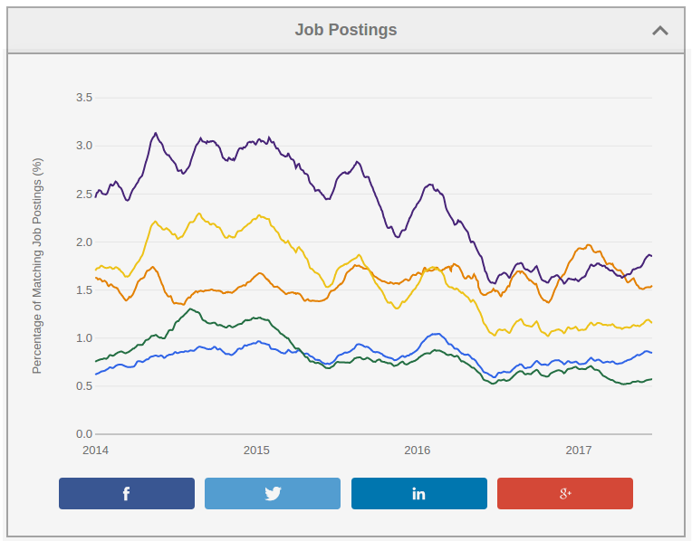

--- 
title: 'Lecture 1: Introduction to R'
date: "October 3, 2017" 
output: 
  revealjs::revealjs_presentation: 
    # incremental: true 
    css: class.css 
    highlight: default 
    smart: true
    center: true
    transition: default 
    background_transition: default 
    self_contained: false 
    fig_width: 6 
    fig_height: 4 
    text-align: left;
    reveal_options: 
      slideNumber: true 
      previewLinks: true 
---

```{r global_options, echo = FALSE, include = FALSE}
options(width = 999)
knitr::opts_chunk$set(warning = FALSE, message = FALSE,
                      cache = FALSE, tidy = FALSE, size = "small")
```

## Contents


<ul style="margin: auto; width: 50%; padding: 10px">
  <li>R language</li>
  <li>How to get and use R?</li>
  <li>R Basics </li>
  <li>Course Objectives & Organization </li>
</ul>


# R language


## What is R?

- R is **a language and environment** for statistical computing and graphics.

> - It was created by Rob Gentleman and Ross Ihaka in 1994; it is based on 
the S language developed at Bell Labs by John Chambers (Stanford Statistics).

> - R is a GNU package, which means it is **freely distributed software**.

> - R is **an integrated suite of software facilities** for data manipulation, 
statistical calculation and graphical display, and is 
**highly extensible**.

> - It is, however, **a fully planned and coherent system**, rather than an incremental
accumulation of specific and inflexible tools.


## Why should you learn R?

<div style="float: center; height: 700px">
  </img> 
  <p style="text-align: center;"> 
  Source: [https://spectrum.ieee.org/](https://spectrum.ieee.org/computing/software/the-2017-top-programming-languages) 
  </p>
</div>


## Why should you learn R?

<div style="float: left; margin-left: 120px; height: 700px">
  </img> 
  <p> Source: [https://indeed.com/jobtrends](https://www.indeed.com/jobtrends/q-Python-q-R-q-c++-q-java-q-sql.html) </p>
</div>
<div style="float: left; height: 250px; width:250px">
  </img> 
</div>


## When should you use R?

- R can be used for **data analysis and visualization**. 

> - It provides efficient **exploration and prototyping** tools, 
but also offers powerful frameworks for **building and fitting statistical models**.

> - R is very good when working with **data that fits in the computer’s memory**.

> - It’s NOT as good for working with massive datasets whose elements 
need to be continuously accessed.


## What makes R good?

> - R is an **interpreted language**, i.e. programs do not need to be 
compiled into machine-language instructions.

> - R is **object oriented**, i.e. it can be extended to include
non-standard data structures (**objects**). A generic function can act
differently depending on what objects you passe to it.

> - R supports **matrix arithmetics**.

> - R packages can generate **publication-quality** plots, 
and **interactive graphics**.

> - Many **user-created R packages** contain implementations of **cutting edge statistics methods**.


## What makes R good?


 As of September 29, there are 11,502 packages on [CRAN](https://cran.r-project.org/), 1,383 on [Biocondictor](https://www.bioconductor.org/), and many others on [github](https://github.com/trending/r?since=weekly))

<section style="float: center; height: 650px">
  </img> 
  <a style="text-align: center;"> 
  Source: [http://blog.revolutionanalytics.com/](http://blog.revolutionanalytics.com/2017/01/cran-10000.html) 
  </a>
</section>


# How to get and use R?

## How to install R?


R is open sources and cross platform (Linux, Mac, Windows).

</br>

To install it just go to **the official R website**
(https://www.r-project.org/), 
download the latest version for your OS and follow the instructions.


## How to run R? (interpreter mode) 

<div class="left", style="width: 65%;"> 
Start the R **console**:

- by launching **the R graphical user interface**

- by typing "R" in **the command line/terminal**. 

Then, use the R commands interactively. To quit use `q()`.

</br>

To open a terminal window use: 

- For linux: `Ctr + Alt + T`
- For Mac: `Command + space`. Type "Terminal" and press `Enter`.  
- For Windows: `WinKey + R`. Type "cmd" and press `Enter`.

</div>

<div class="right", style="width: 35%;"> 
</img> 
</img> 
</div>


## How to run R? (scripting mode) 

- A more convenient way to interact with R is **to write a script**.

- A script should contains all code that you want to execute.

- You should write your R code in **a suitable editor** (NOT in e.g. Microsoft Word).

- After you finish writing your code, save is as an R script file, e.g. `script.R`.

- Then, you can run/execute the code from the terminal by calling `Rscript script.R`


## R Editors

<div class="left", style="width: 40%">
The most popular **R editors** are:

- **Rstudio**, an integrated development environment (IDE) for R.
- **Emacs** (a free, powerful, customizable editor for many languages).

</br>
In this class, we will use **RStudio**, as it is more user-friendly. 
</div>

<div class="right", style="width: 60%">
  </img> 
</div>


## R packages 

<div class="center" style="margin: auto"> 
</img> 
</div>


## R packages 

- R packages are **a collection of R functions, complied code and sample data.**

> - They are stored under a directory called **library** in the R environment. 
> - Some packages are **installed by default** during R installation and are always automatically loaded at the beginning of an R session. 
> - Additional packages by the user from: 
>     + [CRAN](https://cran.r-project.org/web/packages/available_packages_by_name.html) The first and biggest R repository.
>     + [Bioconductor](http://bioconductor.org/): Bioinformatics packages for the analysis of biological data. 
>     + [github](https://github.com/): packages under development


## Available R packages


```{r} 
# Get library locations containing R packages 
.libPaths()
# Get the info on all the packages installed 
installed.packages()[1:5, 1:3]
# Get all packages currently loaded in the R environment 
search() 
``` 


## Installing R packages

- From CRAN: 
 
```{r, eval = FALSE} 
# install.packages("Package Name"), e.g. 
install.packages("glmnet") 
``` 

- From Bioconductor:  
```{r, eval = FALSE} 
# First, load Bioconductor script. You need to have an R version >=3.3.0. 
source("https://bioconductor.org/biocLite.R") 

# Then you can install packages with:  biocLite("Package Name"), e.g. 
biocLite("limma") 
``` 

- From github: 
 
```{r, eval = FALSE} 
# You need to first install a package "devtools" from CRAN 
install.packages("devtools") 

# Load the "devtools" package 
library(devtools) 

# Then you can install a package from some user's reporsitory, e.g. 
install_github("twitter/AnomalyDetection") 

# or using install_git("url"), e.g. 
install_git("https://github.com/twitter/AnomalyDetection") 
``` 


## Useful resources for learning R 

- *R in a nutshell* and introductory book by Joseph Adler - *R tutorial*
(https://www.tutorialspoint.com/r/r_packages.htm) 

- *Advanced R* book by Hadley Wickham for intermediate programmers 
(http://adv-r.had.co.nz/Introduction.html)

- `swirl` R-package for interactive learning for beginners (http://swirlstats.com/) 

- `Data Camp` courses for data science, R, python and more (https://www.datacamp.com/courses) 


# R Basics  


## R as an extensible calculator 

- R has allows you to **intuitively input and easily compute** elementary 
mathematical expressions , e.g.

```{r} 
23 + 8 
abs(-10) 
4 * exp(10) + sqrt(2) 
``` 

- Intuitive arithmetic operators: addition (`+`), subtraction (`-`), multiplication (`*`), 
division: (`/`), exponentiation: (`^`), modulus: (`%%`) 


## Built-in constants

```{r} 
pi
LETTERS 
letters 
month.abb 
month.name 
``` 


## Special values in R 

Some words are **reserved** in `R` and cannot be used as oject/variable/function names:

- `Inf` and `–Inf` which respectively stand for positive and negative infinity. 
R will returnm this value if results are numbers that are too big.

```{r} 
2^1024 
-1/0 
``` 

- `NULL` denotes a null object and is often used as a default value of 
an argument in a function definition, e.g.: 

```{r} 
f1 <- function(arg1, arg2 = NULL) { 
  print(paste("Argument 1 is:", arg1)) 
  if(!is.null(arg2)) 
    print(paste("Argument 2 is:", arg2)) 
} 
``` 


## Special values in R 

- `NA` represents a missing value ("not available"). 
```{r} 
v <- c(1,2,3) 
length(v) <- 4 

# R automatically fills a NA into the end of `v` as no value is provided.
v 
``` 

- `NaN` means ‘Not a Number’, and can result from a computation that is undefined:

```{r} 
0/0 
1/0 - 1/0 
``` 


## Values 

In computer science a value is **an expression which cannot be evaluated any
further**.

</br>

For example, an expression `2 + 3` is not a value as it can be reduced to
expression `5`.

</br>

Examples of values: 

`2, 1057, "Hello world!", "01/20/2016", Inf, TRUE`

<br/>

Values have types ...


## Data types 

The values in R are limited to **only 6 types**:

- **Logical**: `TRUE/FALSE` 
- **Numeric**: `12.4, 30, 2, 1009, 3.141593` 
- **Integer**: `2L, 34L, -21L, 0L` 
- **Complex**: `3 + 2i, -10 - 4i` 
- **Character**: `'a', '23.5', "good", "Hello world!", "TRUE"` 
- **Raw** (used to hold raw bytes): `as.raw(TRUE), as.raw(2), charToRaw("Hello")` 

</br>

**An atomic vector** (one-element vector) is the simplest object in R, 
and it must belong to one of these 6 types.

Fortunately, R supports more complicated, R-objects which are **built 
upon these atomic vectors**.


## Variables 

>- In computer programs, **variables** are used to store various information.

>- Variables are nothing but **reserved memory locations** for storing values.

>- In contrast to other programming languages like C or java, **in R the
variables are NOT declared as some data type/class** (e.g. vectors, lists, data-frames).

>- When variables are assigned with R-Objects, **the data type of the R-object
becomes the data type of the variable**.


## Naming variables 

- A valid **variable name consists of letters, numbers and the dot or underline characters**. 

- The variable name **must start with a letter or the dot not followed by a number**.

Examples of: 

- valid variable names:

`var_name, _var2_name, .var_name , var.name3.`

- invalid variable names:

`var_name%, var.name!, 2var_name, .2var_name`


## Variable assignment 

Variable assignment can be done using the following operators: `=, <-, ->`:


```{r} 
# Assignment using equal operator. 
var.1 = 34759

# Assignment using leftward operator. 
var.2 <-"learn R"

#Assignment using rightward operator. 
TRUE -> var.3 
``` 


The values of the variables can be printed with `print()` function, or `cat()`.
 
```{r} 
print(var.1) 
cat("var.2 is ", var.2)
cat("var.3 is ", var.3 ,"\n") 
``` 


## Variable class 

R is **a dynamically typed language**, which means that we can change a
variable’s data type of the same variable again and again when using it in a
program.

```{r} 
var_x <- "Hello" 
cat("The class of var_x is", class(var_x),"\n")

var_x <- 34.5 
cat("  Now the class of var_x is ",class(var_x),"\n")

var_x <- 27L 
cat("   Next the class of var_x becomes ",class(var_x),"\n") 
``` 


You can see what variables are **currently available in the workspace** by
calling

```{r} 
print(ls()) 
``` 


## Data structures 

There are many types/classes of R-objects, but **the most frequenly used data
structures are**:

- Vectors 
- Matrices 
- Arrays 
- List 
- Data frames 
- Factors


## Vectors 

<div class="left", style="width: 40%">

- **Vectors are the most basic R data objects**. There is no simpler object,
e.g. no scalars.

- Even when you write **just one value in R, it becomes a vector of length 1** 
and belongs to one of the vector types: logical, integer, double, complex,
character and raw.


</div>

<div class="right", style="width: 60%">

- Vectors can be defined using a combine, `c()`, function: 
 
```{r} 
# Create a vector 
(vec1 <- c(1, 3, 7:12)) 
(vec2 <- c('apple', 'banana', 'tangerine', 'watermelon')) 

# Non-character values are coerced to character type if one of the elements is a character 
(s <- c('apple', 123.56, 5, TRUE)) 
``` 

</div>


## Numerical sequences

- Can be genereted with a `seq()` function:  

```{r} 
# Create vector with elements from 5 to 9 incrementing by 0.4. 
(v <- seq(5, 9, by = 0.4))
``` 

- or using a colon operator:
 
```{r} 
# Creating a sequence from 5 to 13. 
(v <- 5:13) 
# Colon can be used also for non-integers (still increments of 1) 
(v <- 6.6:12.6) 
# If the final element specified does not belong to the sequence then it is discarded. 
(v <- 3.8:11.4) 
``` 
  


## Accessing vector elements 

<div class="left", style="width: 40%">


- Elements of a vector can be accessed using indexing, with `[]` brackets.

- Unlike in many languages, in R **indexing starts with `1`**. 

- Using negative integer value indices drops corresponding element of the vector.

- Logical indexing (`TRUE/FALSE`) is allowed. 


</div>

<div class="right", style="width: 60%">

```{r} 
days <- c("Sun","Mon","Tue","Wed","Thurs","Fri","Sat") 

# Accessing vector elements using position. 
(weekend.days <- days[c(1, 7)])

# Accessing vector elements using negative indexing. 
(week.days <- days[c(-1,-7)])

# Accessing vector elements using logical indexing. 
(my.birthday <- days[c(FALSE, FALSE, FALSE, FALSE, TRUE, FALSE, FALSE)])
``` 

</div>

## Vector arithmetics 

Two vectors of same length can be added, subtracted, multiplied or divided
giving an output vector of the same length. 

 
```{r} 
# Create two vectors. 
v1 <- c(1,4,7,3,8,15) 
v2 <- c(12,9,4,11,0,8)

# Vector addition. 
(vec.sum <- v1+v2)

# Vector subtraction. 
(vec.difference <- v1-v2)

# Vector multiplication. 
(vec.product <- v1*v2)

# Vector division. 
(vec.ratio <- v1/v2)
``` 


## Recycling 

- **Recycling** is an automatic lengthening of vectors in certain settings. 
- If an operator (such as +, -, or ^) is applied to two vectors of different lengths,
R will repeat the shorter vector until the length of the longer vector is reached. 

 
```{r, warning=TRUE} 
# The number '3' can be thought of as a vector of length one. 
3 + 1:6

# Add 1 to every other number from 1 to 6. 
0:1 + 1:6

# Multiply two vectors of unequal lengths. 
1:3 * 1:5 
``` 


**Note**: a warning is not an error. It only informs you that your code
continued to run, but perhaps it did not work as you intended.


## Matrices 

- Matrices in R are objects whose elements are arranged in **a two-dimensional
rectangular layout**.

- **All elements must be of the same type** (numeric, logical, character, etc.).
The most frequently used are **numeric matrices**.


## Matrices 


<div class="left", style ="width: 50%">

A matrix can be created with a function

<small>`matrix(data, nrow, ncol, byrow, dimnames)`</small>

where:

- `data` is the input vector with elements of the matrix. 
- `nrow` is the number of rows to be crated 
- `byrow` is a logical value. If `FALSE` (the default) the matrix is 
filled by columns, otherwise the matrix is filled by rows. 
- `dimnames` is `NULL` or a list of length 2 giving the row and column names respectively
 
</div>


<div class="right", style="width: 50%">
```{r, warning=TRUE} 
# Elements are arranged sequentially by row. 
(M <- matrix(c(5:19), nrow = 3, byrow = TRUE))

# Elements are arranged sequentially by column. 
(N <- matrix(c(5:19), nrow = 3, byrow = FALSE))

# Define the column and row names. 
rownames <- c("row1", "row2", "row3") 
colnames <- c("col1", "col2", "col3", "col4", "col5") 
(P <- matrix(c(5:19), nrow = 3, byrow = TRUE, 
             dimnames = list(rownames, colnames))) 
``` 
 </div>


## Accessing Elements of a Matrix 

<div class="left", style="width: 50%">
```{r} 
P
P[2, 5] # the element in 2nd column and 5th row. 


P[2, ] # the 2nd row. 

P[, 3] # the 3rd column. 

``` 
</div>

<div class="right", style="width: 50%">

```{r}
P[c(3,2), ] # the 3rd and 2nd row. 

P[, c(3, 1)] # the 3rd and 1st column. 

P[1:2, 3:5] # Subset 1:2 row 3:5 column 
```
</div>

## Matrix Computations 

Matrix **addition and subtraction** needs matrices of same dimensions: 


<div class="left", style="width: 50%">

```{r} 
# Create two 2x3 matrices. 
(A <- matrix(c(3, 9, -1, 4, 2, 6), nrow = 2)) 
(B <- matrix(c(5, 2, 0, 9, 3, 4), nrow = 2))
``` 
</div>

<div class="right", style="width: 50%">

```{r}
# Add the matrices. 
A + B

# Subtract the matrices 
A - B 
```

</div>


## Matrix Computations 


Matrix **elementwise multiplication and division** needs matrices of same
dimensions: 

 
```{r} 
# Add the matrices. 
A * B

# Subtract the matrices 
A / B 
``` 


## Matrix Algebra 


Linear algebra: *true matrix multiplication* `A x B`, with `A` (m x p) and `B`
(p x n): \((AB)_{ij} = \sum_{k = 1}^p A_{ik}B_{kj} \) can be done using the
`%*%` operator:

 
<div class="left", style="width: 50%">

```{r} 
# A (2 x 3) matrix X 
(X <- matrix(c(3, 9, -1, 4, 2, 6), nrow = 2)) 

# A (3 x 4) matrix Y
(Y <- matrix(c(5, 2, 0, 9, 3, 4, 5, 6, 7, 11, 3, 4), nrow = 3))
``` 
</div>

<div class="right", style="width: 50%">

```{r}
# a matrix product is a (2 x 4) matrix 

X %*% Y 
```
More on matrix algebra operators:
(http://www.statmethods.net/advstats/matrix.html)
</div>


## Arrays 

<div class="left", style="width: 50%">

- Arrays are the R data objects which can store **data in more than two
dimensions.**

- For example, an array of dimension (4, 3, 2) i.e. 4 rows and 3
columns and 2 tables.

- Arrays can store **only one data type**.

- An array is created using the `array()` function.

- Accessing and subsetting elements of an arrays is similar to accessing elements
of a matrix.

</div>

<div class="right", style="width: 50%">

```{r} 
vec <- sample(1:10000, 2*3*4) 
row.names <- c("ROW1","ROW2","ROW3", "ROW4") 
column.names <- c("COL1","COL2","COL3") 
matrix.names <- c("Matrix1","Matrix2")

(arr <- array(vec, dim = c(4,3,2), dimnames = list(row.names, column.names,
matrix.names))) 
``` 
</div>


## Lists 

<div class="left", style="width: 40%">

- In R lists can **contain elements of different types** e.g. numbers, strings, vectors and/or another list.

- A list can also contain matrices or functions as its elements.

- List is created using `list()` function.

</div>

<div class="right", style="width: 60%">


```{r} 
# Create a list containing heterogeneous elements 
(my.list <- list(c("Jan","Feb","Mar"), TRUE, 
                 matrix(c(3,9,5,1,-2,8), nrow =2), 
                 list("green",12.3))) 
```
</div>


## Lists

<div class="left", style="width: 45%">

```{r}
# Create named list 
(named.list <- list(first = "Jane", 
                    last = "Doe", 
                    gender = "Female", 
                    yearOfBirth = 1990)) 
``` 

</div>

<div class="right", style="width: 55%">

```{r} 
student <- list("John", "Smith", "Bioengineering", 
                2019, TRUE)

# Name elements of grades 
names(student) <- c("first", "last", "major",
                    "grad_year", "enrolled") 
student 
``` 

</div>


## Accessing elements of a list 

- Elements of the list can be accessed **by the index** of the element in the
list.

- In case of named lists it can also be accessed **using the names**.

 
```{r} 
# Get the thrird element of the list 
student[[3]]
```


```{r}
# Get the same information using named alement 
student$major
``` 

```{r} 
# Get the first and the thrird element of the list 
student[c(1, 3)]
```


## Data-frames 

<div class="left", style="width: 40%">

A data frame is a table or a **2D array-like structure**.
In data-frames:

- Columns can be store data of different types e.g. logical, numeric, character. 
- Each column must contain the same number of data items.
- The column names should be non-empty. 
- The row names should be unique. 

</div>

<div class="right", style="width: 60%">

```{r} 
# Create the data frame. 
employees <- data.frame(row.names = c("E1", "E2", "E3","E4", "E5"),
                        name = c("Rick","Dan","Michelle","Ryan","Gary"), 
                        salary = c(623.3,515.2,611.0,729.0,843.25), 
                        start_date = as.Date(c("2012-01-01", "2013-09-23", "2014-11-15", "2014-05-11", "2015-03-27")),
                        stringsAsFactors = FALSE ) 
# Print the data frame. 
employees

# Get the structure of the data frame. 
str(employees) 
``` 
</div>


## Data-frames 


We can print the first few rows of a data matrix using a function `head()` 

 
```{r} 
# Print first 2 rows of employees 
head(employees, 2) 
``` 


A very useful function `summary()` gives a statistical summary of the data
stored in the data.frame objects 
 
```{r} 
# Print the summary. 
summary(employees)
``` 


The elements of a data frame can be accessed by indexing just like the elements 
of a matrix.


## Subsetting data-frames

<div class="left", style="width: 50%">

- We can extract specific columns: 
 
```{r eval = FALSE} 
# using column names. 
employees$name
employees[, c("name", "salary")]

# using integer indexing
employees[, 1]
employees[, c(1, 2)]
``` 

```{r echo = FALSE} 
employees$name
employees[, c("name", "salary")]
```

</div>

<div class="right", style="width: 50%">

- We can extract specific row: 

```{r eval = FALSE}
# using row names. 
employees["E1",]
employees[c("E2", "E3"), ]

# using integer indexing
employees[1, ]
employees[c(2, 3), ]
``` 

```{r echo = FALSE} 
employees[1, ]
employees[c(2, 3), ]
```

</div>


## Adding data to data-frames


<div class="left", style="width: 50%">

- We can add a column to a data matrix simply by assignment 

```{r} 
# Add the "dept" coulmn. 
employees$dept <- 
  c("IT","Operations","IT","HR","Finance") 
employees
```

</div>

<div class="right", style="width: 50%">

- Adding a row to a data fram can be done with `rbind()` function 

 
```{r} 
# Create the second data frame 
new.employees <- 
  data.frame(row.names = paste0("E", 6:8), 
             name = c("Rasmi","Pranab","Tusar"), 
             salary = c(578.0,722.5,632.8), 
             start_date = as.Date(c("2013-05-21","2013-07-30","2014-06-17")), 
             dept = c("IT","Operations","Fianance"), 
             stringsAsFactors = FALSE )

# Concatenate two data frames. 
(all.employees <- rbind(employees, new.employees)) 
``` 

</div>


## Factors 

<div class="left", style="width: 45%">

- Factors are used to **categorize the data and store it as levels**. 
- They are useful for variables which take on a limited number of unique values, e.g
`c("bad", "average", "good")`,  `c("Male, "Female")`, `c("yes", "no")` etc. 
- Factors are created using the `factor()` function. 

</div>

<div class="right", style="width: 55%">

```{r} 
month.name 
is.factor(month.name) 
``` 


```{r}
# Apply a factor() function. 
(months.factor <- factor(month.name)) 
is.factor(months.factor)
```

 
</div>


## Factors ordering

- If not specified R will order character type by alphabetical order. 
- Note that factor **labels are not the same as levels**.

```{r}
months <- sample(month.name, 6)
months
```

```{r}
(months <- factor(months, levels = month.name)) 
```

```{r}
(months <- factor(months, levels = month.name, ordered = TRUE)) 
```

```{r}
(months <- factor(months, levels = month.name, labels = month.abb)) 
```


## Dates 

<div class="left", style="width: 50%">

- R makes it easy to work with dates.  

```{r} 
x <- seq(from = as.Date('Jan 01, 2004', format = '%b %d, %Y'), 
         to   = as.Date('2004-12-31'), by = 'day')

table(months(x)) 
which(x == '2004-09-01') 
length(x)                  
# Leap year! 
``` 


</div>

<div class="right", style="width: 50%">

- You can check the presentdate/time by calling:  
```{r} 
# What day  is it? 
Sys.Date()     
```

```{r}
Sys.time()     # What time is it? 
```

```{r}
# Number of days until the end of the year. 
as.Date('2017-12-31') - Sys.Date() 
``` 


- Look up `strptime()` function with `?strptime` command to see a list of 
possible date formatting.

</div>


#  Course Objectives & Organization


## Course Logistics

</br>

- Lectures: Tue, Thu 12:00 PM - 1:20 PM, 300-300 

- Office hours: Thu 3PM, Huang 304

- Class website: https://cme195.github.io/

- Homework submission: https://canvas.stanford.edu/

- Questions/Communication: https://canvas.stanford.edu/

## Topics Covered


* Data types (e.g. logical, numeric, character) 
* Data structures (e.g. vector, matrix, lists, data frames)
* Variable assignment and manipulations 
* File input/output (reading and writing files).
* Functions (function calling and definition) 
* `apply, lapply, sapply, mapply` functions 
* Data processing using `dplyr, tidyr`
* 2D, 3D plotting 
* interactive plotting 
* Supervised learning methods 
* Unsupervised learning methods 


## Course Expectations

</br>

There are no formal pre-requisites, but some prior 
**knowledge of statistics and programming experience** 
is strongly encouraged.

</br>

During the course you will learn about some statistical methods. They will be
briefly explained, but the mathathematics or the technical details on the
algorithms won't be discussed.

</br>

Instead, I will show you how to perform the tasks using the R implementation of
these methods. You will learn how to input the data, set parameters, and
interpret the output of the methods.


## Work Load 

</br>


- two homework assignments (due a week after posted)

- a final group (up to 3 people) project


## Final Project 

</br>

> - Choose a project that is interesting and allows you to practice your R skills.

> - You are welcome to choose a project related to your own research.

> - Your project should incorporate methods learnt from the course, but you are
encouraged to use tools and packages not covered in class.

> - Proposal (title and one-paragraph abstract) due **(10/24)** by the end of
class.

> - Final write-up due a week after the last class **(11/03)**.


## Final Project 

Final project should involve **an extensive use of R**. Focus on the programming
part, not on answering the research question. Project Ideas:

- **Sports data**. e.g. decide which basketball player would you want on your
team?

- **Financial data**. Perform time-series analysis of stock returns, or
construct optimal portfolios for a set of equities.

- **Credit card data**. Detect fraudulent transactions.

- **Twitter data**. Use the content of the posts to perform activity and
sentiment analysis.

- **User preference data**. e.g. develop a movie recommender system.

- **Cities/States data**. e.g. identify the best and worst neighborhoods to live
in, or predict when/where crimes occur.

- **Biological data**. Tons of possibilities including differential gene
expression, single cell, flow cytometry, mass spectronomy, image data analysis.

