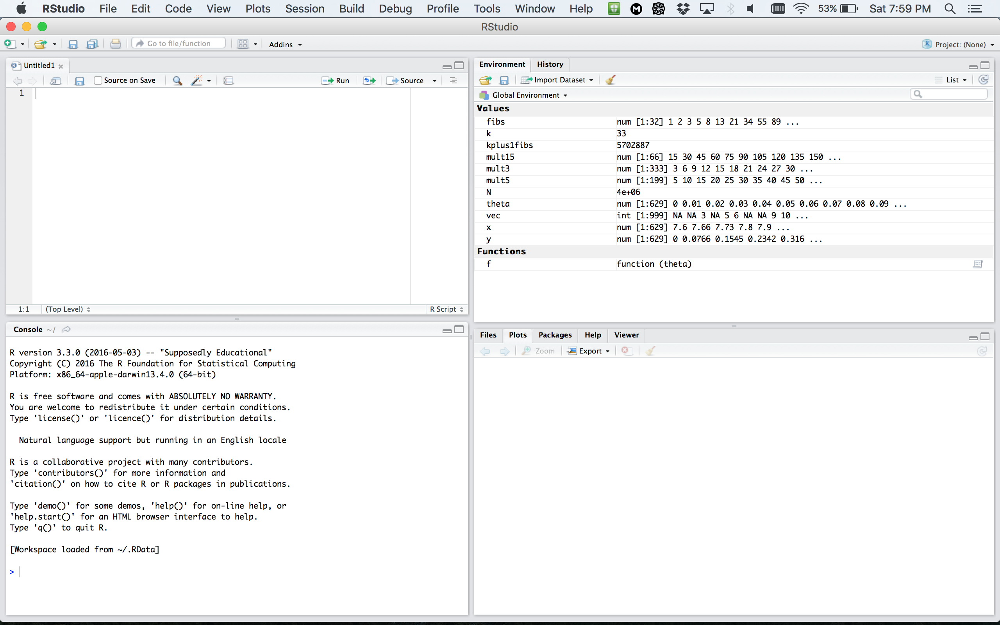
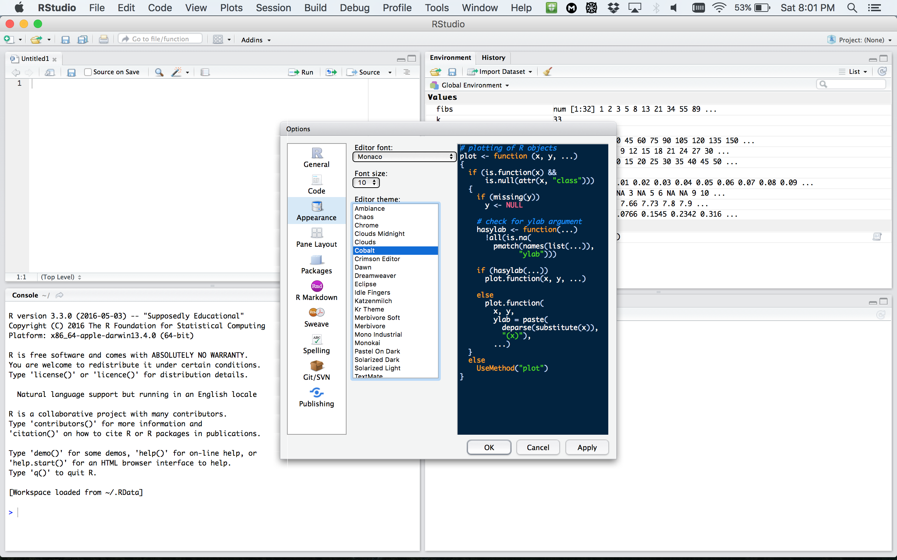

--- 
title: 'Lecture 2:  Syntax, control flow, functions'
date: "October 5, 2017" 
output: 
  revealjs::revealjs_presentation: 
    self_contained: false
    lib_dir: libs
    css: class.css
    highlight: default 
    smart: true
    center: true
    transition: default 
    background_transition: default 
    fig_width: 6 
    fig_height: 4 
    text-align: left;
    reveal_options: 
      slideNumber: true 
      previewLinks: true 
---

```{r global_options, echo = FALSE, include = FALSE}
options(width = 999)
knitr::opts_chunk$set(warning = FALSE, message = FALSE,
                      cache = FALSE, tidy = FALSE, size = "small")
```

## Contents

* RStudio
* Syntax
* File input/output
* Control flow statements
* Functions

# RStudio 

## RStudio window

<div style="float: center; height: 600px">
  </img> 
</div>


## RStudio preferences


<div style="float: center; height: 600px">
  </img> 
</div>


## RStudio layout

<div style="float: center; height: 600px">
  </img> 
</div>


## RStudio apprearance


<div style="float: center; height: 550px">
  </img> 
</div>
More on RStudio cuztomization can be found [here](https://support.rstudio.com/hc/en-us/articles/200549016-Customizing-RStudio)


## R document types

<div style="float: center; height: 600px">
  </img> 
</div>


## R document types

- [R Script](https://cran.r-project.org/doc/contrib/Lemon-kickstart/kr_scrpt.html) **a text file** 
containing R commands stored together.

- [R Markdown](http://rmarkdown.rstudio.com/lesson-1.html)
files can generate high quality reports contatining notes, code and code outputs.
**Python and bash code ** can also be executed.

- [R Notebook](http://rmarkdown.rstudio.com/r_notebooks.html) is 
an R Markdown document with **chunks that can be executed independently and 
interactively**, with output visible immediately beneath the input.

- [R presentation](https://support.rstudio.com/hc/en-us/articles/200486468-Authoring-R-Presentations) 
let's you author **slides** that make use of R code and LaTeX equations 
as **straightforward** as possible.

- [R Sweave](https://support.rstudio.com/hc/en-us/articles/200552056-Using-Sweave-and-knitr) 
enables the embedding of **R code within LaTeX documents**.

- [Other](http://rmarkdown.rstudio.com/formats.html) documents

## Working with code chunks

<br/>

Keyboard shortcuts:

- Insert a new code chunk: **Ctrl + Alt + I** (Mac OS: **Cnd + Option + I**)

- Run the current chunk: **Ctrl + Shift + Enter** (Mac OS: **Cmd + Shift + Enter**) 

- Run the current statement (the line where the cursor is) **Ctrl + Enter** 
(Mac OS: **Cmd + Enter**) 


# Syntax

## Style Guide

* There are two main style conventions used in R:
    + [Hadley Wickam style](http://adv-r.had.co.nz/Style.html)
    + [Google R style](https://google.github.io/styleguide/Rguide.xml)
* You can use either of the two style guides or create your own customized style.
* But you should stay **consistent**, e.g. if you choose to assign variables 
with `<-`, stick to it and don't use `=`.


## Identifiers 

**Google Convention:** 

* No underscores ( _ ) or hyphens ( - ) in identifiers. 
* **Variable names** all with lower case letters; words separated with dots 
('variable.name'), but 'variableName' is also accepte
* **Function names** have initial capital letters and no dots 
('FunctionName'). Function names should be verbs. Constants are named like 
functions but with an initial k.

```{r, eval = FALSE}
# Good
avg.clicks            # variable name
CalculateAvgClicks    # function name
# Bad
avg_Clicks                                 # variable name
calculate_avg_clicks , calculateAvgClicks  # function name
```

## Identifiers 

**Hadley Convention:**

- Variable and function names should be lowercase. 
- Use an underscore (_) to separate words within a name. 
- Generally, variable names should be nouns and function names should be verbs. 
- Use names that are concise and meaningful. 

```{r eval = FALSE}
# Good
day_one
day_1

# Bad
first_day_of_the_month
DayOne
dayone
djm1
```


## Spacing

- Place spaces around all infix operators (=, +, -, <-, etc.). 

- Always put a space after a comma, and never before (just like in regular English).

- Place a space before left parentheses, except in a function call.

```{r eval = FALSE}
# Good
average <- mean(feet / 12 + inches, na.rm = TRUE)
if (debug) do(x)
plot(x, y)
if (debug) do(x)
diamonds[5, ]

# Bad
average<-mean(feet/12+inches,na.rm=TRUE)
if(debug)do(x)
plot (x, y)
if ( debug ) do(x)  # No spaces around debug
x[1,]               # Needs a space after the comma
x[1 ,]              # Space goes after comma not before
```


## Code Documentation 

<div class="left", style="width: 50%">

- Comment your code! They will be helpful when you read 
your code a month after you wrote it.

- In R each line of a comment should begin with a comment symbol "`# `". 

```{r}
# Function returns the answer to life, 
# the universe and everything else
get_answer <- function(){
  return(42)
}
```

</div>

<div class="right", style="width: 50%">

- Comments are not subtitles, i.e. don't repeat the code in the comments.

```{r, eval = FALSE}
# Loop through all bananas in the bunch
for(banana in bunch) {
  # make the monkey eat one banana
  MonkeyEat(b)  
}
```

- Use commented lines of - and = to break up your file into easily readable chunks.

```{r, eval = FALSE}
# Load data ---------------------------
# Plot data ---------------------------
```

</div>

## Curly braces

<div class="left", style="width: 40%">

-  An opening curly brace "`{`" should never go on its own line and should 
always be followed by a new line. 
- A closing curly "`}`" brace should always go on its own line, unless it’s 
followed by else.
- Always indent the code inside curly braces.
- It’s ok to leave very short statements on the same line

</div>

<div class="right", style="width: 60%">

```{r eval = FALSE}
# Good
if (y < 0 && debug) {
  message("Y is negative")
}
if (y == 0) {
  log(x)
} else {
  y ^ x
}

# Bad
if (y < 0 && debug)
message("Y is negative")

if (y == 0) {
  log(x)
} 
else {
  y ^ x
}
```

```{r eval = FALSE}
if (y < 0 && debug) message("Y is negative")
```

</div>

# File Input/Output


## Working Directory

<div class="left", style="width: 50%">

- The **current working directory** (cmd) is the location
which R is currently pointing to

- Whenever you try to read or save a file without specifying 
the path explicitly, the cmd will be used by default.

- When are executing code from an R markdown/notebook code chunk, 
the cmd is **the location of the document**.

</div>

<div class="right", style="width: 50%">

- To see the current working directory use `getwd()`:
```{r}
getwd()   # with no arguments
```

- To change the working directory use `setwd(path_name)` 
with a specified path as na argument:
```{r eval = FALSE}
setwd("path/to/directory")
```
</div>


## Paths and directory names

- In Windows, a directory usually has an address of the following form: `C:\Users\lan\folder`.

- R inherits its file and folder naming conventions from unix, and instead uses forward slashes
instead of backslashes, e.g. `C:/Users/lan/folder/`

- The Mac OSX already uses the unix standards, the address is usually of the form: `/home/lan/folder/`.

- So, when working in R use the forward slashes "/".

- Actually for Windows, you can use either "`C:/Path/To/A/File`" or "`C:\\Path\\To\\A\\File`".


## Paths and directory names

- R uses forward slashes for the directories, because backslashes serve 
a different purpose. They are used as escape characters to isolate special 
characters and stop them from being immediately interpreted.

- To avoid problems, directory names should NOT contain spaces and special characters.

-  Use a "`Tab`" for autocompletion to find file paths more easily. 


## Data import 


- **Text Files in a table format** can be read and saved 
to a selected variable using a `read.table()` function.
Use `?read.table` to learn more about the function.

- A common text file format is a **comma delimited text file**,
`.csv`. These files use a comma as column separators, e.g:

```{r eval = FALSE}
Year,Student,Major
2009, John Doe,Statistics
2009, Bart Simpson, Mathematics I
```

- To read these files use the following command:

```{r eval=FALSE}
mydata <- read.table("path/to/filename.csv", header=TRUE,  sep = ",")
# read.csv() has covenient argument defaults for '.csv' files
mydata <- read.csv("path/to/filename.csv")
```

- Optionally, use `row.names` or `col.names` arguments
to set the row and column names.


## Data import 

- **Excel files**. To read the excel files you need
to first install a package "xlsx". Simply run 
`install.packages("xlsx")`.

```{r eval = FALSE}
# first row contains variable names
library(xlsx)
# read the 1st worksheet
mydata <- read.xlsx("/path/to/filename.xlsx", 1)  

# read in the worksheet named mysheet
mydata <- read.xlsx("/path/to/filename.xlsx", sheetName = "mysheet")
```

- **SAS files**. You need to install the `Hmisc` or `foreign` 
packages first.

```{r eval = FALSE}
# First, save your SAS dataset in trasport (xport) format
libname out xport 'path/to/filename.xpt';
data out.mydata;
set sasuser.mydata;
run;

# Then, in R 
library(Hmisc)
mydata <- sasxport.get("path/to/filename.xpt")
# character variables are converted to R factors
# or
library(foreign)
mydata <- read.xport("path/to/filename.xpt")
```


## Data export

- **Text files**:
```{r eval = FALSE}
write.table(mydata, "path/to/filename.txt", sep="\t")  # tab-delimited
write.table(mydata, "path/to/filename.csv", sep=",")   # comma-delimited
write.csv(mydata, "path/to/filename.csv")              # comma-delimited
```

- **Excel spreadsheet**:

```{r eval = FALSE}
library(xlsx)
write.xlsx(mydata, "path/to/filename.xlsx")
```

- **SAS** files:
```{r eval = FALSE}
# write out text datafile and an SAS program to read it
library(foreign)
write.foreign(mydata, datafile = "path/to/filename.txt", 
              codefile = "path/to/filename.sas",  package="SAS")
```

Here are links to more details on data 
[import](http://www.statmethods.net/input/importingdata.html)
and [export](http://www.statmethods.net/input/exportingdata.html). 

## Saving the workspace

- You can choose to **save all objects** currently in the workspace
(variables, functions, etc.) into a file e.g. `filename.rda`.

- The file `filename.rda` can be loaded next time you work with R.

- You can also save a single object or a subset of specified
objects currently in the workspace.

```{r eval = FALSE}
# save the workspace to file 
save.image(file = "path/to/filename.rda")

# save specific objects to a file
save(object_list, file = "path/to/filename.rda")

# save just a single object
saveRDS(object, file = "path/to/filename.rds")
```

- Saved objects/workspace can be loaded back in a new R session.

```{r eval = FALSE}
# load a workspace into the current session
load("path/to/filename.rda")

# read just the previously saved 1 object
object <- readRDS("path/to/filename.rds")
```


## Exercise 1

- Download "Lec2_ex.Rmd" file from the Lectures tab on class website.

- Open the file in RStudio.

- Do Exercise 1.


# Control flow

## Booleans/logicals

<div class="left", style="width: 50%">


**Booleans** are logical data types (TRUE/FALSE) associated
with conditional statements, which allow different actions 
and change control flow.

```{r}
# equal "==""
5 == 5
# not equal: "!="" 
5 != 5 
# greater than: ">""
5 > 4 
# greater than or equal: ">="" (# similarly < and <=)
5 >= 5
```

</div>

<div class="right", style="width: 50%">

```{r}

# You can combine multiple boolean expressions
TRUE & TRUE
TRUE & FALSE 
TRUE | FALSE
!(TRUE)
```
</div>


## Booleans/logicals

In R if you combine 2 vectors of booleans,
by each element then use `&`. Rember the **recycling property** for vectors.

```{r}
c(TRUE, TRUE) & c(FALSE, TRUE)
c(5 < 4, 7 == 0, 1< 2) | c(5==5, 6> 2, !FALSE)
c(TRUE, TRUE) & c(TRUE, FALSE, TRUE, FALSE)  # recycling
```

## Booleans/logicals


If we use double operators `&&` or `||` is used only the first 
elements are compared:

```{r}
c(TRUE, TRUE) && c(FALSE, TRUE)
c(5 < 4, 7 == 0, 1< 2) || c(5==5, 6> 2, !FALSE)
c(TRUE, TRUE) && c(TRUE, FALSE, TRUE, FALSE)
```


## Booleans/logicals

- Another possibility to combine booleans is to use
`all()` or `any()` functions:

```{r}
all(c(TRUE, FALSE, TRUE))
any(c(TRUE, FALSE, TRUE))
all(c(5 > -1, 3 >= 1, 1 < 1))
any(c(5 > -1, 3 >= 1, 1 < 1))
```


## Control statements

* **Control flow** is the order in which individual statements, 
instructions or function calls of a program are evaluated.

* Control statements allow you to do more complicated tasks.

* Their execution results in a choice between which of 
two or more paths should be followed.
    + `If` / `else`
    + `For`
    + `While`


## If statements

<div class="left", style="width: 50%">

- Decide on whether a block of code should be executed
based on the associated boolean expression.

- **Syntax**. The if statements are followed by
a boolean expression wrapped in parenthesis. 
The conditional block of code is inside curly
braces `{}`.

```{r eval = FALSE}
if (traffic_light == "green") {
  print("Go.")
}
```

</div>

<div class="right", style="width: 50%">

- 'if-else' statements let you introduce more options

```{r eval = FALSE}
if (traffic_light == "green") {
   print("Go.")
} else {
   print("Stay.")
}
```

- You can also use `else if()`

```{r eval = FALSE}
if (traffic_light == "green") {
   print("Go.")
} else if (traffic_light == "yellow") {
  print("Get ready.")
} else {
   print("Stay.")
}
```

</div>


## For loops

</br>

- A for loop is a statement which **repeats the execution a block of code** 
a given number of iterations.

```{r}
for (i in 1:5){
  print(i^2)
}
```


## While loops

</br>

- Similar to for loops, but repeat the execution 
as long **as the boolean condition supplied is TRUE**.

```{r}
i = 1
while(i <= 5) {
  cat("i =", i, "\n")
  i = i + 1
}
```


## Next


<div class="left", style="width: 50%">

- `next` halts the processing of the current iteration 
and advances the looping index. 

```{r}
for (i in 1:10) {
  if (i <= 5) {
    print("skip")
    next
  }
  cat(i, "is greater than 5.\n")
}
```
</div>

<div class="right", style="width: 50%">

- `next` applies only to the innermost of nested loops.

```{r}
for (i in 1:3) {
  cat("Outer-loop i: ", i, ".\n")
  for (j in 1:4) {
    if(j > i) {
      print("skip")
      next
    }
    cat("Inner-loop j:", j, ".\n")
  }
}
```

</div>


## Break

- The `break` statement allows us to break out out of a for, 
while loop (of the smallest enclosing).
- The control is transferred to the first statement outside 
the inner-most loop. 

```{r}
for (i in 1:10)  {
  if (i == 6)  {
    print(paste("Coming out from for loop Where i = ", i))
    break
  }
  print(paste("i is now: ", i))
}
```


## Exercise 2

</br>

- Go back to "Lec2_ex.Rmd" in RStudio.

- Do Exercise 2.


# Functions

## Functions

- A **function** is a procedure/routine that performs a specific task.

- Functions are used to **abstract** components of larger program.

- They are like a mathematical functions. They **take some input 
and then do something to find the result**.

- Functions allow you to **automate common tasks** in a more powerful 
and general way than copy-and-pasting. 

- A general rule is that you should **use a function, whenever you’ve copied 
and pasted a block of code more than twice**.


## Function Definition

<div class="left", style="width: 40%">

- To define a function you assigne a variable name 
to a `function` object.

- Functions take **arguments, mandatory and optional**.

- Provide the brief **description of your function in comments**
before the function definition.


</div>

<div class="right", style="width: 60%">

```{r}
# Computes mean and standard deviation
# and optionally prints the results.
mysummary <- function(x, print=TRUE) {
  center <- mean(x)
  spread <- sd(x) 
  if (print) {
    cat("Mean =", center, "\n", 
        "SD = ", spread, "\n")
  }
  result <- list(mean=center, 
                 sd=spread)
  return(result)
}
```
</div>


## Calling functions


```{r}
x <- rnorm(n = 500, mean = 4, sd = 1) 
y <- mysummary(x)
```

```{r}
# without printing
y <- mysummary(x, print = FALSE)
```

```{r}
# Results are stored in list "y"
y$mean
y$sd
```

```{r}
# The order of arguments does not matter if the names are specified
y <- mysummary(print=FALSE, x = x)
```


## Exercise 3

</br>

- Go back to "Lec2_ex.Rmd" in RStudio.

- Do Exercise 3.


## apply, lapply, sapply functions

- The `apply` family functions, are 
**functions to manipulate slices of data** from matrices, 
arrays, lists and dataframes **in a repetitive way**. 

- These functions **avoid explicit use of loops**. 
`apply` might be **computationally more efficient than
for loops**, depending on how big your data is.
For more details see this 
[link](https://www.r-bloggers.com/gnu-r-loop-speed-comparison/).

- The apply functions allow you to perform operations with 
**very few lines of code.**

- The family comprises: **apply, lapply , sapply, vapply, 
mapply, rapply, and tapply**. The difference lies in the structure
of input data and the desired format of the output).


## lapply/sapply functions

<div class="left", style="width: 50%">

- `lapply()` is used to **repeatedly apply a function to 
a elements of sequential objects** such as vectors, lists, 
or data-frames (applies to columns).

- The **output returned is a list** with the same number of 
elements as the input object.

- `sapply` is the same as `lapply` but returns a "simplified" output.

- user-defined functions can be used with `sapply/lapply`

</div>

<div class="right", style="width: 50%">

```{r}
lapply(1:3, function(x) x^2)
unlist(lapply(1:3, function(x) x^2))
sapply(1:3, function(x) x^2)
sapply(1:3, function(x) x^2, simplify = F)
```

</div>

## apply function

`apply` operates on arrays/matrices. 
In the example below we obtain column sums of matrix "X".

```{r}
(X <- matrix(sample(30), nrow = 5, ncol = 6))
apply(X, MARGIN = 2 , FUN = sum)
```

**Note:** that in a matrix `MARGIN=1` indicates rows and `MARGIN=2`
indicates columns.


## apply function


<div class="left", style="width: 50%">
- `apply` can be used with **user-defined functions**:

```{r}
print(X)
apply(X, 2, function(x) sum(x < 15)) # number entries < 15
```

</div>

<div class="right", style="width: 50%">
- The function can be defined outside `apply()`,


```{r}
logColMeans <- function(x, eps = NULL) {
  if (!is.null(eps)) x <- x + eps
  return(mean(x))
}
apply(X, 2, logColMeans) 
apply(X, 2, logColMeans, eps = 0.1) 
```

</div>

 
## mapply functions


- `mapply` stands for 'multivariate' apply.  It **applies a function
to a multiple list or multiple vectors as arguments**. 
- The goal is to vectorize arguments to a function which usually 
does not accept vectors as arguments. 

```{r}
# function word() returns a string of character C repeated k times.
word <- function(C,k) paste(rep.int(C,k), collapse='')
mapply(word, LETTERS[1:6], 6:1, SIMPLIFY = FALSE)
```


## Exercise 4

</br>

- Go back to "Lec2_ex.Rmd" in RStudio.

- Do Exercise 4.

