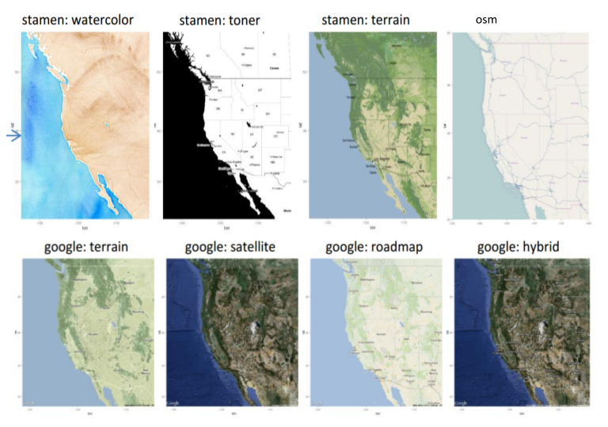

```{r setup, include=FALSE}
knitr::opts_chunk$set(cache=TRUE)
.packages <- c("ggplot2", "plotly", "heatmaply", "ggmap", "dplyr")
lapply(.packages, require, character.only = TRUE)
```

## Packages:

* **`plotly`** - package translates 'ggplot2' graphs to an interactive web-based 
version and/or create custom interactive web-based visualizations directly 
from R.
  
* **`heatmaply`** - package for generating interactive heatmaps

* **`ggmap`** - package that let you retrieve maps from popular
online mapping services like Google Maps, OpenStreetMap, Stamen Maps,
and plot them using the ggplot2 framework

## Install the packages

```{r installation, eval = FALSE}
# Install packages:
.packages <- c("ggplot2", "plotly", "heatmaply", "ggmap", "dplyr")
lapply(.packages, install.packages, dependencies = TRUE)
```


# `plotly`

## `plotly` package

> - `plotly` is **a package for visualization** 
and a collaboration platform for data science
> - Available in **R, python, MATLAB, scala**.  
> - You can produce **interactive graphics including 3D plots**
(with zooming and rotating).
> - You can open a **'plotly' account ** to upload 'plotly' graphs 
  and view or modify them in a web browser.
> - Resources: [cheatsheet](https://images.plot.ly/plotly-documentation/images/r_cheat_sheet.pdf), 
[book](https://plotly-book.cpsievert.me)

## `plotly` integration with `ggplot2`

```{r plotly-ggplot2}
library(plotly); library(ggplot2); library(dplyr)
plt <- ggplot(diamonds %>% sample_n(1000), aes(x = carat, y = price)) + 
  geom_point(aes(color = cut))
ggplotly(plt) 
```


##

```{r plotly-ggplot2-facet}
plt <- ggplot(diamonds %>% sample_n(1000), aes(x = carat, y = price)) + 
  geom_text(aes(label = clarity), size = 4) + 
  geom_smooth(aes(color = cut, fill = cut)) +
  facet_wrap(~cut)
ggplotly(plt) 
```


## 3D Scatter plots

```{r plotly-scatter3D}
theta <- seq(0, 10, 0.2); 
df <- data.frame(U = theta, V =  cos(theta), W = sin(theta)*theta)
plot_ly(df, x = ~V, y = ~W, z = ~U, type = "scatter3d", mode = "markers",
        marker = list(size = 3))
```

##

```{r plotly-scatter3D-col, message=FALSE, warning=FALSE}
df$cols <- rep_len(c("orange", "blue", "green"), length.out = length(theta))
(plt <- plot_ly(df, x = ~V, y = ~W, z = ~U, color = ~cols,
        type = "scatter3d", mode = "markers+lines",
        marker = list(size = 5), line = list(width = 5)))
```


## Adding layers

```{r plotly-scatter3D-layer}
dbl.helix <- data.frame(t = rep(seq(0, 2*pi, length.out = 100), 3)) %>%
  mutate(x1 = sin(t), y1 = cos(t), z = (1:length(t))/10,
         x2 = sin(t + pi/2), y2 = cos(t + pi/2))
plot_ly(dbl.helix, x = ~x1, y = ~y1, z = ~z, type = "scatter3d", mode = "lines", 
        color = "green", colors = c("green", "purple"), line = list(width = 5)) %>% 
  add_trace(x = ~x2, y = ~y2, z = ~z+0.2, color = "purple") 
```

## Volcano dataset

* **`volcano`** - a built-in dataset storing topographic information 
for Maunga Whau (Mt Eden), one of 50 volcanos in Auckland, New Zealand.
* It consist of a 87 x 61 matrix with entries corresponding to the mountain's 
atlitutes [m] on a 10m by 10m grid.  
* rows run east to west, and columns south to north

```{r print-volcano}
dim(volcano)
volcano[1:5, 1:5]
``` 

## 2D contour plots

```{r plotly-contour2D}
plot_ly(z = volcano) %>% add_contour()
```

## 3D surface plots

```{r plotly-surf3D}
plot_ly(z = volcano) %>% add_surface()
```


# Heatmaps

## Heatmap 

* *A heatmap* is a popular graphical method for **visualizing high-dimensional data (table or matrix format)**
* Heatmaps display data (variables, correlations, sparsity/missing data pattern) as a grid of colored cells.
* They are commonly used in genomics papers to show **gene expression levels**,

> The rows and the columns of the heatmaps are usually ordered to highlight 
the patterns in the data, and are usually accompanied by 
dendograms.


## Scale `mtcars` data

We convert each variable (column) in `mtcars` to Z-scores, i.e. we subtract
the column mean and scale by its standard deviation.

```{r mtcars-scale}
mtscaled <- as.matrix(scale(mtcars))
head(mtscaled)
```

## Generate a basic heatmap

```{r heatmap-mtcars, fig.height=7, fig.width=10}
# Using basic `stats::heatmap` function:
heatmap(mtscaled, Rowv = NA, Colv = NA)
```

## Heatmap with dendograms 


```{r heatmap-mtcars-cust-dend, fig.height=7, fig.width=10}
# heatmaps with dendograms and rows and columns reoredered by means
heatmap(mtscaled)
```

## Compute dendograms

```{r dendograms, fig.width=15, fig.height=4}
# Cluster rows (by default healmaps uses method = "euclidean")
row.clus <- hclust(dist(mtscaled, method = "manhattan") , "aver")
row.dend <- as.dendrogram(row.clus)

# Cluster columns
col.clus <- hclust(dist(t(mtscaled), method = "manhattan"), "aver")
col.dend <- as.dendrogram(col.clus)

# Plot dendograms:
layout(matrix(c(1,2),nrow=1), widths=c(3,2)); par(mar = c(8,4,1,1))
plot(row.dend, xlab = "", main = "Row Dendogram", sub = "")
plot(col.dend, xlab = "", main = "Column Dendogram", sub = "")
```

## Heatmaps with customized dendograms

```{r heatmap-mtcars-dend, fig.height=7, fig.width=10}
# heatmaps with dendograms and reordered (by means) rows and columns 
heatmap(mtscaled, Rowv = row.dend, Colv = col.dend)
```

##

```{r fig.height=7, fig.width=10}
library(RColorBrewer)
# Define color scheme
scaleredblues <- colorRampPalette(colors = brewer.pal(9, "RdBu"))(10)
#  "#B2182B" "#D25849" "#ED9576" "#FAC9B0" "#F9EAE1" "#E6EFF3" "#BCDAEA" "#80B9D8" "#3F8EC0" "#2166AC"
heatmap(as.matrix(mtscaled), col = scaleredblues) 
```


## heatmaply package for interactive heatmaps

<div class="center">
```{r  warning = FALSE, message = FALSE,  fig.height=7.5, fig.width=8}
library(heatmaply)
heatmaply(mtscaled) %>% layout(margin = list(l = 150, b = 50))
```
</div>

## Color the dendogram branches:

<div class = "center">
```{r warning = FALSE, message = FALSE, fig.height=7.5, fig.width=15}
heatmaply(mtscaled, k_col = 2, k_row = 3) %>%
  layout(margin = list(l = 150, b = 50), autosize = F, width = 600, height = 700)
```
</div>


# `ggmap` for visualizing spatial data

## `ggmap` for plotting maps 

<div class = "left", style= "font-size:30px; width: 40%">
1. Define location: 3 ways
    - location/address
    - lat/long
    - bounding box 

 2. Define map source, type, and color with `get_map()`:
    - Google Maps ("google"), 
    - OpenStreetMap ("osm"), 
    - Stamen Maps ("stamen"), 
    - CloudMade maps ("cloudmade")

3. You can set **the scale of the map using zoom**. 
 `get_map()` takes a guess at the zoom level, but
 you can alter it. 
    - 3 (continent) to 21 (building), default value 10 (city). 
    - "openstreetmap" and "stamen" limit is 0-18.

</div>

<div class = "left", style= "font-size:36px; width: 60%">

```{r, message=FALSE, warning=FALSE, fig.width=4, fig.height=3}
library(ggmap)
geocode("Stanford University") 
myLoc <- "Stanford University" # or myLoc <- c(-125, 35, -120, 40)
# or myLoc <- c(lon = -122.1697, lat = 37.42747)
myMap <- get_map(location = myLoc, crop = TRUE, zoom = 16,
                 source = "google", maptype="satellite")
ggmap(myMap)
```
</div>

## Map sources


<div class = "left", style= "font-size:36px; width: 40%">
There are different map sources to obtain a map raster, and each of these
sources has multiple "map types". Here we show examples of maps from:

* **stamen:** maptype = c(“terrain”, “toner”, “watercolor”)
* **google:** maptype = c(“roadmap”, “terrain”, “satellite”, “hybrid”)
* **osm:** [open street map](http://www.openstreetmap.org/)
</div>

<div class = "left", style= "font-size:36px; width: 60%">


</div>

##

```{r, message=FALSE, warning=FALSE}
US <- c(left = -125, right = -67, bottom = 25.75, top = 49)
us_map <- get_map(location = US, source = "stamen", maptype = "toner-lite", zoom = 5)
class(us_map)
```

```{r us-map, fig.width=10, fig.height=6}
ggmap(us_map)
```


##

```{r eu-map, warning = FALSE, message=FALSE,  fig.width=6, fig.height=5.5}
europe <- c(left = -12, right = 30,  bottom = 35.0, top = 63)
europe_map <- get_stamenmap(bbox = europe, zoom = 5, maptype = "watercolor") 
ggmap(europe_map)
```


## Adding data

```{r, message=FALSE, warning=FALSE}
Lisbon <- geocode("Lisbon")
Warsaw <- geocode("Warsaw")
road <- data.frame(latitude = seq(Lisbon$lat, Warsaw$lat, length.out =30),
                   longitude = seq(Lisbon$lon, Warsaw$lon, length.out = 30))
ggmap(europe_map)+
 geom_point(data = road, aes(x = longitude, y = latitude), 
            alpha = .5, color="darkred")
```

