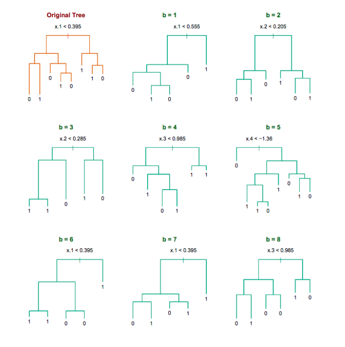
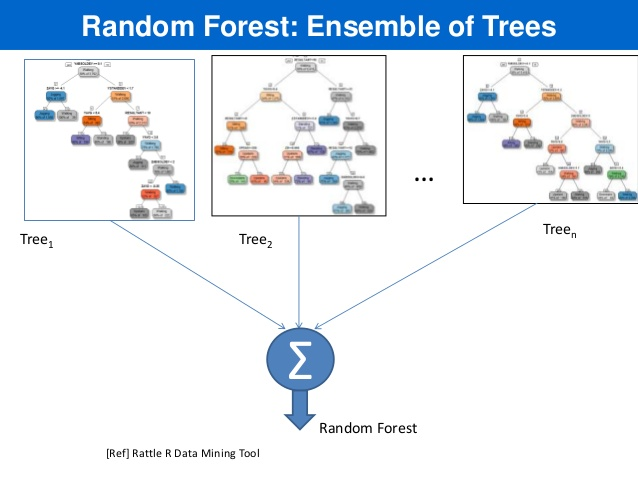
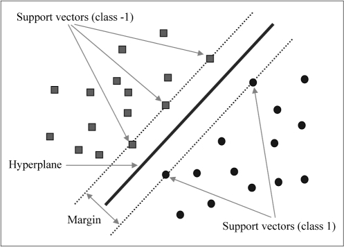

```{r setup, include=FALSE}
rm(list = ls())
knitr::opts_chunk$set(cache=TRUE)
.packages <- c("ggplot2", "dplyr")
sapply(.packages, require, character.only = TRUE)
```

## Contents

* Logistic Regression
* Random Forest
* Extra: Support Vector Machines 


## Classification

* **Classification** is a supervised methood which deals with prediction 
outcomes or **response variables that are qualitative, or categorical**.

* The task is to classify or **assign each observation to a category or a class.**

* Examples of classification problems include:
    + predicting what medical condition or disease a patient has base on their
    symptoms,
    + determining cell types based on their gene expression profiles
    (single cell RNA-seq data).
    + detecting fraudulent transactions based on the transaction history


# Logistic Regression

## Logistic Regression

* Logistic regression is actually used for **classification**, and not
regression tasks, $Y \in \{0, 1\}$.

* The name **regression** comes from the fact that the method **fits a 
linear function to a continuous quantity, the log odds of the response**.

$$
p = P[Y = 1 \mid X]\\
\log\left(\frac{p}{1-p}\right) = X\beta = \beta_0 + \beta_1^Tx 
$$

* The method performs **binary classification** (k = 2), but can be generalized
to handle $k > 2$ classes (**multinomial logistic regression**).

##

$$
\begin{align*}
g(p) &= \log\left(\frac{p}{1 - p}\right), \quad \quad \; \text{ ( logit a link function ) } \\
g^{-1}(\eta) &= \frac{1}{1 + e^{-\eta}},  \quad \quad \quad \quad \text{ ( logistic function ) }\\
\eta &= X\beta, \quad  \quad \quad \quad \quad \quad \text{ ( linear predictor ) } \\
&\\
E[Y] &= P[Y = 1 \mid X = x] \quad \; \text{ ( probability of outcome ) } \\
&= p = g^{-1}(\eta) \\
& = {1 \over 1 + e^{-X\beta}}
\end{align*}
$$

## 

```{r, echo = FALSE}
x <- seq(-10, 10, length.out = 100)
df <- data.frame(x, y1 = 1/(1 + exp(-(-2 + x))),
                 y2 = 1/(1 + exp(-x)),
                 y3 = 1/(1 + exp(-(2 + x))),
                 y4 = 1/(1 + exp(-(2*x))),
                 y5 = 1/(1 + exp(-x)),
                 y6 = 1/(1 + exp(x)),
                 y7 = 1/(1 + exp(2*x)))
df <- df %>% tidyr::gather(key = "curve", value = "values", -x)         
ggplot(df %>% filter(curve %in% c("y1", "y2", "y3")), 
       aes(x = x, y = values, color = curve)) + 
  geom_line(lwd = 1) +
  scale_color_discrete(
    name="Coefficients",
    labels= c(expression(paste(beta[0] == -2, ", ", beta[1] == 1)), 
              expression(paste(beta[0] == 0, ", ", beta[1] == 1)), 
              expression(paste(beta[0] == 2, ", ", beta[1] == 1)))) +
 theme_classic() + theme(text = element_text(size = 20)) 
  
```

##

```{r, echo = FALSE}
ggplot(df %>% filter(curve %in% c("y4", "y5", "y6", "y7")), 
       aes(x = x, y = values, color = curve)) + 
  geom_line(lwd = 1) +
  scale_color_discrete(
    name="Coefficients",
    labels= c(expression(paste(beta[0] == 0, ", ", beta[1] == -2)), 
              expression(paste(beta[0] == 0, ", ", beta[1] == -1)), 
              expression(paste(beta[0] == 0, ", ", beta[1] == 1)),
              expression(paste(beta[0] == 0, ", ", beta[1] == 2)))) +
   theme_classic() + theme(text = element_text(size = 20)) 

```


## Grad School Admissions

Suppose we would like to predict students' admission to graduate school
based on their GRE, GPA, and the rank of their undergraduate institution.

```{r}
admissions <- read.csv("https://stats.idre.ucla.edu/stat/data/binary.csv")
admissions <- tbl_df(admissions)
admissions
```

## 

```{r}
summary(admissions)
sapply(admissions, sd)
```

Check that there are observations included in each subgroup, and whether
the data is balanced:

```{r}
with(admissions, table(admit, rank))
```


## Logistic Regression in R

* In R logistic regression can be done using a function `glm()`.
* `glm` stands for Generalized Linear Model.
* The function can fit many other regression models. Use `?glm` to learn more.
*  For cases with $k >2$ classes, `multinom()` function from `nnet` package
can be used. To see how go over this 
[example](https://stats.idre.ucla.edu/r/dae/multinomial-logistic-regression/).


##

Note that currently the column 'admit' and 'rank' in `admissions` are integers.

```{r}
sapply(admissions, class)
```
We convert the two columns to factors.

```{r}
admissions <- mutate(admissions,
  admit = factor(admit, levels = c(0, 1), labels = c("rejected", "admitted")),
  rank = factor(rank, levels = 1:4)
)
admissions
```

## Split data

Divide data into train and test set so that we can evaluate the model
accuracy later on. Here we use 70%-30% split.

```{r}
set.seed(123456)
train.idx <- sample(nrow(admissions), 0.7*nrow(admissions))
train <- admissions[train.idx, ]
test <- admissions[-train.idx, ]
```


## Fitting a logistic regression model 

```{r}
fit.logit <- glm(admit ~ gre + gpa + rank, data = train, 
                 family = "binomial")
```


* The first argument, \
`formula = admit ~ gre + gpa + rank`, \
specifies the linear predictor part, $\eta = X\beta$. 

* You need to set the family to `family = "binomial"` equivalent to choosing
a logistic regression, i.e. using **a logit link function** $g(\cdot)$ in
a GLM model.


##

```{r}
summary(fit.logit)
```


##

Logistic regression **coefficients** for continuous predictors (covariates)
give **the log fold change in the odds of the outcome corresponding to a unit 
increase in the predictor**.

$$
\begin{align*}
\beta_{cont} &= \log \left({P[Y = 1 \;| \; X_{cont} = x + 1 ] \over P[Y = 1\;|\; X_{cont} = x]} \right)\\
\end{align*}
$$

**Categorical features (factors) are first converted to indicator variables** 
and then the model fits separate coefficients for each level of the factor.
Coefficients corresponding to a specific indicator variable give the 
increase/decrease in the log odds of the outcome in case the observation
is recorded with that level.

$$
\begin{align*}
\beta_{facL} &= \log \left({P[Y = 1 \;| \; X_{fac} =  L ] \over P[Y = 1\;|\; X_{fac} \ne L ]} \right)\\
\end{align*}
$$


## 

```{r}
coef(fit.logit)
```

</br> 

* For every unit increase in `gre`, the log odds of admitted 
(versus rejected) increases by $\approx$ `r coef(fit.logit)[["gre"]]`.

* For every unit increase in `gpa`, the log odds increases by $\approx$
`r coef(fit.logit)[["gpa"]]`. 

* There are three coefficients for the rank variable, e.g. 
a student attending a college with rank 2, one with rank 1 (base level), has
the log admission odds decreased by $\approx$ `r coef(fit.logit)[["rank2"]]`.


##

You can get the confidence intervals for the coefficients with the `confint()`
fuinction

```{r}
confint(fit.logit)
```

The $95\%$ CI are away from zero which indicates significance.

##

Rank variable effect is given with three different coeffients.

We can sse `wald.test()` function from the `aod` package to test the overall
effect of 'rank'.

```{r}
# install.packages(aod)
library(aod)
wald.test(b = coef(fit.logit), Sigma = vcov(fit.logit), Terms = 4:6)
```

* `b` supplies the coefficients, 
* `Sigma` supplies the variance covariance matrix of the error terms, 
* `Terms` indices of the coefficients to be tested; here 4, 5, and 6, 
corresponding to 'rank'.

The p-value indicates that the overall effect of rank 
is statistically significant.

## Predictions

Predictions can be computed using `predict()` function, with the argument
`type = "response"`. Otherwise, the default will compute predictions
on the scale of the linear predictors.

```{r}
# Must have the same column names as the variables in the model 
newStudents <- data.frame(gre = c(670, 790, 550), 
                          gpa = c(3.56, 4.00, 3.87), 
                          rank = factor(c(1, 2, 2)))

# The output is the probability of admissions for each of the new students.
newStudents <- newStudents %>% 
  mutate(
    pred.prob.admit = predict(fit.logit, newdata = newStudents, 
                              type = "response"),
    admit = factor(pred.prob.admit < 0.5, levels = c(TRUE, FALSE),
                   labels = c("rejected", "admitted"))
  )
newStudents
```

## Test Set Predictions 

```{r}
pred.prob.admit <- predict(fit.logit, newdata = test, type = "response")
admit <- factor(pred.prob.admit < 0.5, levels = c(TRUE, FALSE),
                labels = c("rejected", "admitted"))
(confusion.matrix <- table(pred = admit, true = test$admit))
# Accuracy
sum(diag(confusion.matrix))/nrow(test)
```


## Exercise

</br>

- Go to the "Lec7_Exercises.Rmd" file, which can be downloaded
from the class website under the Lecture tab.

- Complete Exercise 1.


# Random Forest

## Random Forest

* Random Forest is **an ensemble learning method based on classification 
and regression trees, CART,** proposed by 
[Breinman](http://link.springer.com/article/10.1023/A:1010933404324) in 2001.
* RF can be used to perform **both classification and regression**.
* RF models are robust as they **combine predictions calculated from a large 
number of decision trees (a forest).**
* Details on RF can be found in Chapter 8 of 
[ISL](http://www-bcf.usc.edu/~gareth/ISL/ISLR%20Sixth%20Printing.pdf)
and Chapter 15 [ESL](http://statweb.stanford.edu/~tibs/ElemStatLearn/); 
also a good write-up can also be found 
[here](http://www.bios.unc.edu/~dzeng/BIOS740/randomforest.pdf)

## Decision trees

* Cool visualization explaining what decision trees are:
[link](http://www.r2d3.us/visual-intro-to-machine-learning-part-1/)

* Decision tree on classification of Titanic Survivors:

```{r, message=FALSE, warning=FALSE, echo=FALSE, fig.width=8, fig.height=6, fig.align='center'}
library(rpart)
library(rpart.plot)
data(ptitanic)
tree <- rpart(survived ~ ., data=ptitanic, cp=.02)
cols <- c("darkred", "green4")[tree$frame$yval] # green if survived
prp(tree, tweak=1.4, extra=106, under=TRUE, branch=.5, faclen=0,
    ge=" > ", eq=" ", split.prefix="is ", split.suffix="?",
    col=cols, border.col=cols, trace=FALSE)
```

## Tree bagging Algorithm

Suppse we have an input data matrix, $X \in \mathbb{R}^{N \times p}$ and a
response vector, $Y \in \mathbb{R}^N$.

<div style="color:#00008f">
For b = 1, 2, ..., B:

$\quad$  1. Generate a random subset of the data $(X_b, Y_b)$ contatining $n < N$ 
\vspace{-10mm}

$\quad \;$ observations sampled with replacement.

$\quad$  2. Train a decision tree $T_b$ on $(X_b, Y_b)$

$\quad$  3. Predict the outcome for $N-n\;$ unseen (complement) samples $(X_b', Y_b')$

Afterwards, combine predictions from all decision trees and compute the average 
predicted outcome .
</div>

</br>

**Averaging over a collection of decision trees makes the predictions
more stable.**


## Decision trees for bootrap samples

<div style="text-align: center">



Source: [Chapter 8 ESL](https://web.stanford.edu/~hastie/ElemStatLearn/)
</div>


## Random Forest Characteristics

* Random forests differ in only one way from tree bagging: it uses a modified 
tree learning algorithm sometimes called **feature bagging**. 

* At each candidate split in the learning process, **only a random subset of 
the features is included in a pool** from which the variables can be selected
for splitting the branch.

* Introducing **randomness** into the candidate splitting variables,
**reduces correlation between the generated trees.** 

##

<div style="text-align: center">

</div>

##

<div style="text-align: center">



Source: [link](http://www.slideshare.net/satnam74/india-software-developers-conference-2013-bangalore)
</div>


## Wine Quality

UCI ML Repo includes two datasets on red and white variants of the Portuguese 
["Vinho Verde" wine](http://www.vinhoverde.pt). The datasets contain information 
on physicochemical and sensory characteristics of the wine quality score.

We will use the white wines dataset to classify wines according to their quality classes.

```{r}
url <- 'https://archive.ics.uci.edu/ml/machine-learning-databases/wine-quality/winequality-white.csv'
wines <- tbl_df(read.csv(url, sep = ";"))
print(wines, n = 6)
```

## Class Frequency

```{r, fig.width=10, fig.height=6, fig.align='center'}
ggplot(wines, aes(x = quality)) +
  geom_bar() + theme_classic() +
  ggtitle("Barplot for Quality Scores")
```

<p style="font-size: 30px"> 
The classes are ordered and not balanced (munch more normal wines than excellent/poor ones). 
</p>

##

To make things easier, we will wines into **"good", "average" and "bad"** categories. 

The new classes will be more balanced, and it will be easier to fit the model.


```{r}
qualClass <- function(quality) {
  if(quality > 6) return("good")
  if(quality < 6) return("bad")
  return("average")
}
wines <- mutate(wines, taste = sapply(quality, qualClass),
         taste = factor(taste, levels = c("bad", "average", "good")))
wines
```


##

```{r, fig.width=8, fig.height=5, fig.align='center'}
table(wines$quality)

ggplot(wines, aes(x = taste)) +
  geom_bar() + theme_classic() +
  ggtitle("Barplot for Quality Scores")
```

## Splitting data 

We include 60% of the data in a train set and the remaining into a test set.
```{r}
set.seed(123)
train.idx <- sample(nrow(wines), 0.6 * nrow(wines))
train <- wines[train.idx, ]
test <- wines[-train.idx, ]
dim(train)
dim(test)
```


## Random Forest in R

In R there is a convenient function `randomForest` from `randomForest` package.

```{r}
# install.packages("randomForest")
library(randomForest)
rf.wines <- randomForest(taste ~ . - quality, data = train,
                         mtry = 6, ntree = 600, importance = TRUE)
```

* Note that in the formula '`taste ~ . - quality`' means we include all features 
EXCEPT for 'quality' (the response variable). 

* `mtry` - the number of variables randomly sampled as candidates at each split. 
Defaults: for classification -- $\sqrt{p}$ and for regression -- $p/3$,
where $p$ is number of all variables in the model.

* `ntree` - the number of trees in the forest.

* `importance` - whether importance of predictors be computed.

##

Observe, that RF is good at distinguishing "bad" wines
from"good" wines, but still struggles when it comes to
"average" wines.

```{r}
rf.wines
```

## Model Accuracy

* You should always evaluate your model's performance on
a test set, which was set aside and not observed by 
the method at all.

* In case of RF, performance on train and test set should be similar; 
this is because the method averages predictions computed by individual
trees for observations unseen by the tree.  

* Inspect the confusion matrix to asses the model accuracy.
```{r}
pred <- predict(rf.wines, newdata = test)
(confusion.mat <- table(pred, truth = test$taste))
```

```{r}
(rf.accuracy <- sum(diag(confusion.mat)) / nrow(test))
```

## 

https://stats.stackexchange.com/questions/197827/how-to-interpret-mean-decrease-in-accuracy-and-mean-decrease-gini-in-random-fore
```{r}
## Look at variable importance:
importance(rf.wines)
```

##

What seems to be the conclusion? What are the characteristics that are predictive 
of the wine quality score?

```{r}
varImpPlot(rf.wines)
```


## Exercise

</br>

- Go to the "Lec7_Exercises.Rmd" file, which can be downloaded
from the class website under the Lecture tab.

- Complete Exercise 2.


# Support Vector Machines

## Suport Vector Machines (SVM)

* Method invented by Vladimir N. Vapnik and Alexey Ya. Chervonenkis in 1963. 

* The idea is to find the best hyperplane sepparating observations from 2 different classes,
where the best means the one that represents the largest separation or margin.

* The Andrew Ng's CS229 [lecture](https://www.youtube.com/watch?v=_PwhiWxHK8o)
and [notes](http://cs229.stanford.edu/notes/cs229-notes3.pdf) are good resources 
to learn about principles of SVMs.

* More details can also be found in Chapter 9 
[ISL](http://statweb.stanford.edu/~tibs/ElemStatLearn/)
and Chapter 12 [ESL](http://statweb.stanford.edu/~tibs/ElemStatLearn/)


##

<div style="text-align: center">




</div>

## SVM Problem

\begin{align}
\max_{w, b} & \quad \frac{2}{\|w\|} \\
s.t. \; \forall i: \;  y_i (w \cdot & x_i + b) \ge 1
\end{align}

which can be converted to:

\begin{align}
\min_{w, b} \quad  {1 \over 2}& \|w\|^2  \\
s.t. \; \forall i: \; y_i (w \cdot x_i & + b) \ge 1
\end{align}

## SVM Problem

Sometimes the data is not linearly separable,
and regularization/soft-margin works better:
\begin{align}
\min_{w, b}  {1 \over 2} \|w\|^2 & + C \sum_{i = 1}^n \xi_i\\
s.t. \; \forall i: \; y_i (w \cdot x_i + b) &\ge 1 - \xi_i\\
\xi_i &\ge 0
\end{align}

Lagrangian:

\begin{align}
\mathcal{L}(w, b, \xi, \alpha, r)
= {1\over 2} & w^Tw + C \sum_{i = 1}^n \xi_i - \sum_{i = 1}^n r_i \xi_i \\
& -\sum_{i = 1}^n \alpha_i\left[ y_i (w \cdot x_i + b) - 1 + \xi_i\right] 
\end{align}

## SVM Example

We will do a simple example from the ISL computing SVM on a simulated data:
```{r}
set.seed(1)
x <- matrix(rnorm(40*2), ncol=2)
y <- c(rep(-1,20), rep(1,20))
x[y == 1, ] <- x[y == 1, ] + 2
dat <- data.frame(x = x, y=as.factor(y))
head(dat)
```

##

```{r}
plot(x[, 2], x[, 1], col=(3-y))
```

## SVM in R

You can use the `e1071` package to perform svm in R.
```{r fig.height=3.5}
library(e1071)
# Set scale to be FALSE otherwise by default x is scaled to zero mean and unit variance
svmfit <- svm(y ~ ., data=dat, kernel="linear", cost = 10, scale=FALSE)
summary(svmfit)
```

##

```{r}
svmfit$index
plot(svmfit, dat)
```

##

```{r}
svmfit <- svm(y~., data=dat, kernel="linear", cost=0.05, scale=FALSE)
svmfit$index
summary(svmfit)
```
##

```{r}
plot(svmfit, dat)
```


##

To find a best choice of the tuning parameter "C" use the `tune()` function

```{r}
set.seed(1)
tune.out <- tune(svm,y ~ ., data=dat, kernel="linear",
                 ranges=list(cost=c(0.001, 0.01, 0.05, 0.1, 1,5,10,20)))
summary(tune.out)
```
##

```{r}
bestmod <- tune.out$best.model
plot(bestmod, dat)
```

##

We build a new test dataset from a similar model as we did for the train data.

```{r}
set.seed(1)
xtest <- matrix(rnorm(30*2), ncol=2)
ytest <- sample(c(-1,1), 30, rep=TRUE)
xtest[ytest == 1, ] <- xtest[ytest == 1,] + 2
testdat <- data.frame(x = xtest, y = as.factor(ytest))
plot(xtest[, 2], xtest[, 1], col=(3-ytest))
```

##

```{r}
ypred <- predict(bestmod, testdat)
table(predict = ypred, truth = testdat$y)
```

And for the non-tuned model we have:

```{r}
svmfit <- svm(y~., data=dat, kernel = "linear", cost=10, scale = FALSE)
ypred <- predict(svmfit, testdat)
table(predict = ypred, truth = testdat$y)
```

## Kernel SVM


## Kernel SVM Example

Now suppose we have non-linearly separable data:

```{r}
set.seed(1)
# Generate 200 points
x <- matrix(rnorm(400*2), ncol=2)
x[1:100,] <- x[1:100,] + 2
x[101:200,] <- x[101:200, ] - 2
y <- c(rep(1,200), rep(2,200))
dat <- data.frame(x = x, y = as.factor(y))
# Let a random half be a training set
trainIdx <- sample(400, 200)
```

##

```{r}
plot(x[trainIdx, 2], x[trainIdx, 1], col=y[trainIdx])
```

##

We will use the SVM with **a radial kernel**. Note that here we can additionally 
specify the `gamma` parameter for the radial function:

```{r}
svmfit <- svm(y~., data=dat[trainIdx,], kernel = "radial",  gamma=1, cost=1)
table(true = dat[-trainIdx,"y"], pred=predict(svmfit, newdata = dat[-trainIdx, ]))
```

##

```{r}
plot(svmfit, dat[trainIdx,])
```

##

We can tune both `gamma` and `cost` parameters:

```{r}
tune.out <- tune(svm, y~., data=dat[trainIdx,], kernel="radial", 
              ranges=list(cost=seq(0.01, 15, length.out = 10), 
                          gamma=seq(0.01, 5, length.out = 5)))
table(true = dat[-trainIdx,"y"], 
      pred = predict(tune.out$best.model, newdata = dat[-trainIdx,]))
```

##

```{r}
plot(tune.out$best.model, dat[trainIdx,])
```


