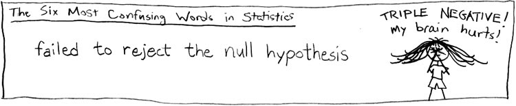
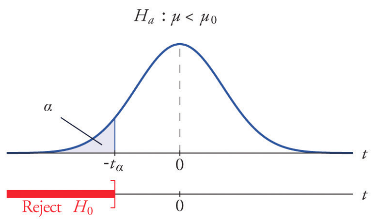
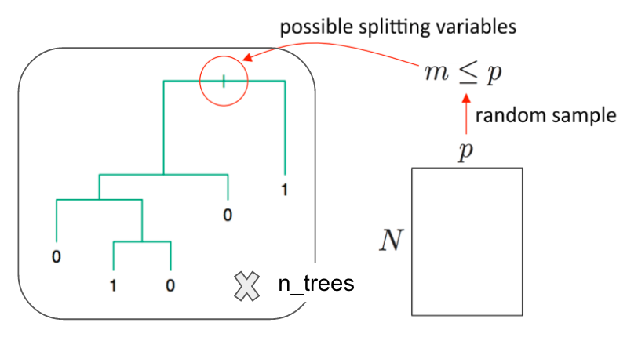

```{r include=FALSE}
rm(list = ls())
knitr::opts_chunk$set(cache=TRUE)
library(tidyverse)
```

## Contents

<div class="left", style="width: 50%">

* Hypothesis testing

* Logistic Regression

* Random Forest

</div>

<div class="right", style="width: 50%">

</div>

# Hypothesis testing

## Hypothesis testing can answer questions:

- **Is the measured quantity equal to/higher/lower than a given threshold?**
e.g. is the number of faulty items in an order statistically higher
than the one guaranteed by a manufacturer? 
- **Is there a  difference between two groups or observations**? 
e.g. Do treated patient have a higher survival rate than the untreated ones?
- **Is the level of one quantity related to the value of the other quantity?**
e.g. Is hyperactivity related to eating sugar? Is lung cancer related to smoking?

## To perform a hypothesis test you need to:

> 1. Define the null and alternative hypotheses.
> 2. Choose level of significance $\alpha$.
> 3. Pick and compute test statistics.
> 4. Compute the p-value.
> 5. Check whether to reject the null hypothesis by comparing p-value to $\alpha$.
> 6. Draw conclusion from the test.

## Null and alternative hypotheses

**The null hypothesis ($H_0$)**: A statement assumed to be true unless it can be 
shown to be incorrect beyond a reasonable doubt. This is something one usually 
attempts to disprove or discredit. 

**The alternate hypothesis ($H_1$)**: A claim that is contradictory to 
H0 and what we conclude when we reject H0.

H0 and H1 are on purporse set up to be contradictory, so that one **can collect
and examine data to decide if there is enough evidence to reject the null 
hypothesis or not**. 

##




## Student's t-test

- William Gosset (1908), a chemist at **the Guiness brewery**.
- Published in Biometrika under a **pseudonym Student**.
- Used to select best yielding varieties of barley.
- Now one of the standard/traditional methods for hypothesis testing.

Among the typical applications:

- Comparing population mean to a constant value
- Comparing the means of two populations
- Comparing the slope of a regression line to a constant

In general, used when the test statistic would follow a normal distribution 
if the value of a scaling term in the test statistic were known.

## Distribution of the t-statistic


If $X_i \sim \mathcal{N}(\mu, \sigma^2)$, the empirical estimates for mean
and variance are:
$\bar X = \frac{1}{n}\sum_{i = 1}^{n} X_i$ and 
$s^2 = \frac{1}{n - 1}\sum_{i = 1}^n(X_i -\bar X)^2$

The t-statistic is:

$$
T = \frac{\bar X −mu}{s/\sqrt{n}}\sim t_{\nu=n-1}
$$

## p-value

- p-value is the **probability of obtaining the same or "more extreme" event 
than the one observed, assuming the null hypothesis holds (is true)**.

- A small p-value, typically < 0.05, indicates **strong evidence** against the
null hypothesis; in this case you can reject the null hypothesis.

- A large p-value, > 0.05, indicates **weak evidence** against the null 
hypothesis; in this case, you do NOT reject the null hypothesis.

## 

$$p-value = P[observations \; \mid \; hypothesis] \ne P[hypothesis \; \mid \; ovservations]$$


**p-values should NOT be used a "ranking"/"scoring" system for your hypotheses**

## Two-sided test of the mean

<div class = "left">
Is the mean flight arrival delay statistically equal to 0?

</br>
**Test the null hypothesis:**

\[H_0: \mu = \mu_0 = 0 \\
H_a: \mu \ne \mu_0 = 0\]
where $\mu$ is where $\mu$ is the average arrival delay.
</div>

<div class = "right">

</div>


##
```{r}
library(tidyverse)
library(nycflights13)
mean(flights$arr_delay, na.rm = T)
```

Is this statistically significant?

```{r}
( tt = t.test(x=flights$arr_delay, mu=0, alternative="two.sided" ) )
```

##

The function t.test returns an object containing the following components:

```{r}
names(tt)
```

```{r}
# The p-value:
tt$p.value
```

```{r}
# The 95% confidence interval for the mean:
tt$conf.int
```


## One-sided test of the mean

<div class = "left">
One-sided can be more powerful, but the intepretation is more difficult.


</br>
**Test the null hypothesis:**

\[H_0: \mu = \mu_0 =0 \\
H_a: \mu < \mu_0 = 0\]

</div>

<div class = "right">


```{r, eval = FALSE}
t.test(x, mu=0, alternative="less")
```

</div>

##

Is the average delay 5 or is it lower?


```{r}
( tt = t.test(x=flights$arr_delay, mu=5, alternative="less" ) )
```

Failure to reject is not acceptance of the null hypothesis.


## Testing difference between groups 

Is the average arrival delay the same for the winter and summer?

</br>
**Test the null hypothesis:**

\[H_0: \mu_{a} = \mu_{b}\\
H_a: \mu_{a} \ne \mu_{b}\]

where $\mu_{a}$ mean `arr_delay` in the winter 
and $\mu_b$ is the mean `arr_delay` in the summer.

```{r, eval = FALSE}
t.test(x, y)
```


## Seasonal differences in flight delay

```{r}
flights %>% 
  mutate(season = cut(month, breaks = c(0,3,6,9,12))) %>% 
  ggplot(aes(x = season, y = arr_delay)) + geom_boxplot (alpha=0.1) +
    xlab("Season" ) + ylab("Arrival delay" )
```

## Seasonal differences in flight delay

```{r}
flights %>% 
  filter(arr_delay < 120) %>%
  mutate(season = cut(month, breaks = c(0,3,6,9,12))) %>% 
  ggplot(aes(x = season, y = arr_delay)) + geom_boxplot (alpha=0.01) +
    xlab("Season" ) + ylab("Arrival delay" )
```


## Testing seasonal differences in flight delay

```{r}
flights.winter = filter(flights, month %in% c(1,2,3))
flights.summer = filter(flights, month %in% c(7,8,9))
t.test(x=flights.winter$arr_delay, y=flights.summer$arr_delay)
```


## Exercise

</br>

- Go to the "Lec7_Exercises.Rmd" file, which can be downloaded
from the class website under the Lecture tab.

- Complete Exercise 1.

## Classification

* **Classification** is a supervised methood which deals with prediction 
outcomes or **response variables that are qualitative, or categorical**.

* The task is to classify or **assign each observation to a category or a class.**

* Examples of classification problems include:
    + predicting what medical condition or disease a patient has base on their
    symptoms,
    + determining cell types based on their gene expression profiles
    (single cell RNA-seq data).
    + detecting fraudulent transactions based on the transaction history


# Logistic Regression

## Logistic Regression

* Logistic regression is actually used for **classification**, and not
regression tasks, $Y \in \{0, 1\}$.

* The name **regression** comes from the fact that the method **fits a 
linear function to a continuous quantity, the log odds of the response**.

$$
p = P[Y = 1 \mid X]\\
\log\left(\frac{p}{1-p}\right) = X\beta = \beta_0 + \beta_1^Tx 
$$

* The method performs **binary classification** (k = 2), but can be generalized
to handle $k > 2$ classes (**multinomial logistic regression**).

##

$$
\begin{align*}
g(p) &= \log\left(\frac{p}{1 - p}\right), \quad \quad \; \text{ ( logit a link function ) } \\
g^{-1}(\eta) &= \frac{1}{1 + e^{-\eta}},  \quad \quad \quad \quad \text{ ( logistic function ) }\\
\eta &= X\beta, \quad  \quad \quad \quad \quad \quad \text{ ( linear predictor ) } \\
&\\
E[Y] &= P[Y = 1 \mid X = x] \quad \; \text{ ( probability of outcome ) } \\
&= p = g^{-1}(\eta) \\
& = {1 \over 1 + e^{-X\beta}}
\end{align*}
$$

## 

```{r, echo = FALSE}
x <- seq(-10, 10, length.out = 100)
df <- data.frame(x, y1 = 1/(1 + exp(-(-2 + x))),
                 y2 = 1/(1 + exp(-x)),
                 y3 = 1/(1 + exp(-(2 + x))),
                 y4 = 1/(1 + exp(-(2*x))),
                 y5 = 1/(1 + exp(-x)),
                 y6 = 1/(1 + exp(x)),
                 y7 = 1/(1 + exp(2*x)))
df <- df %>% tidyr::gather(key = "curve", value = "values", -x)         
ggplot(df %>% filter(curve %in% c("y1", "y2", "y3")), 
       aes(x = x, y = values, color = curve)) + 
  geom_line(lwd = 1) +
  scale_color_discrete(
    name="Coefficients",
    labels= c(expression(paste(beta[0] == -2, ", ", beta[1] == 1)), 
              expression(paste(beta[0] == 0, ", ", beta[1] == 1)), 
              expression(paste(beta[0] == 2, ", ", beta[1] == 1)))) +
 theme_classic() + theme(text = element_text(size = 20)) 
  
```

##

```{r, echo = FALSE}
ggplot(df %>% filter(curve %in% c("y4", "y5", "y6", "y7")), 
       aes(x = x, y = values, color = curve)) + 
  geom_line(lwd = 1) +
  scale_color_discrete(
    name="Coefficients",
    labels= c(expression(paste(beta[0] == 0, ", ", beta[1] == -2)), 
              expression(paste(beta[0] == 0, ", ", beta[1] == -1)), 
              expression(paste(beta[0] == 0, ", ", beta[1] == 1)),
              expression(paste(beta[0] == 0, ", ", beta[1] == 2)))) +
   theme_classic() + theme(text = element_text(size = 20)) 

```


## Grad School Admissions

Suppose we would like to predict students' admission to graduate school
based on their GRE, GPA, and the rank of their undergraduate institution.

```{r}
admissions <- read_csv("https://stats.idre.ucla.edu/stat/data/binary.csv")
admissions
```

## 

```{r}
summary(admissions)
sapply(admissions, sd)
```

Check that there are observations included in each subgroup, and whether
the data is balanced:

```{r}
with(admissions, table(admit, rank))
```


## Logistic Regression in R

* In R logistic regression can be done using a function `glm()`.
* `glm` stands for Generalized Linear Model.
* The function can fit many other regression models. Use `?glm` to learn more.
*  For cases with $k >2$ classes, `multinom()` function from `nnet` package
can be used. To see how go over this 
[example](https://stats.idre.ucla.edu/r/dae/multinomial-logistic-regression/).


##

Note that currently the column 'admit' and 'rank' in `admissions` are integers.

```{r}
sapply(admissions, class)
```

We convert the two columns to factors.

```{r}
admissions <- mutate(admissions,
  admit = factor(admit, levels = c(0, 1), labels = c("rejected", "admitted")),
  rank = factor(rank, levels = 1:4)
)
admissions
```

## Split data

Divide data into train and test set so that we can evaluate the model
accuracy later on. Here we use 60%-20%-20% split.

```{r}
set.seed(78356)
n <- nrow(admissions)
idx <- sample(1:n, size = n)
train.idx <- idx[seq(1, floor(0.6*n))]
valid.idx <- idx[seq(floor(0.6*n)+1, floor(0.8*n))]

train <- admissions[train.idx, ]
valid <- admissions[valid.idx, ]
test <- admissions[-c(train.idx, valid.idx), ]

nrow(train)
nrow(valid)
nrow(test)
```


## Fitting a logistic regression model 

```{r}
logit_fit <- glm(
    admit ~ gre + gpa + rank, data = train, family = "binomial")
```


* The first argument, \
`formula = admit ~ gre + gpa + rank`, \
specifies the linear predictor part, $\eta = X\beta$. 

* You need to set the family to `family = "binomial"` equivalent to choosing
a logistic regression, i.e. using **a logit link function** $g(\cdot)$ in
a GLM model.


##

Logistic regression **coefficients** for continuous predictors (covariates)
give **the log fold change in the odds of the outcome corresponding to a unit 
increase in the predictor**.

$$
\begin{align*}
\beta_{cont} &= \log \left({P[Y = 1 \;| \; X_{cont} = x + 1 ] \over P[Y = 1\;|\; X_{cont} = x]} \right)\\
\end{align*}
$$

**Categorical features (factors) are first converted to indicator variables** 
and then the model fits separate coefficients for each level of the factor.
Coefficients corresponding to a specific indicator variable give the 
increase/decrease in the log odds of the outcome in case the observation
is recorded with that level.

$$
\begin{align*}
\beta_{factor} &= \log \left({P[Y = 1 \;| \; X_{fac} =  L ] \over P[Y = 1\;|\; X_{fac} \ne L ]} \right)\\
\end{align*}
$$


## 

```{r}
coef(logit_fit)
```

</br> 

* For every unit increase in `gre`, the log odds of admitted 
(versus rejected) increases by $\approx$ `r coef(logit_fit)[["gre"]]`.

* For every unit increase in `gpa`, the log odds increases by $\approx$
`r coef(logit_fit)[["gpa"]]`. 

* There are three coefficients for the rank variable, e.g. 
a student attending a college with rank 2, one with rank 1 (base level), has
the log admission odds decreased by $\approx$ `r coef(logit_fit)[["rank2"]]`.


##

You can get the confidence intervals for the coefficients with the `confint()`
fuinction

```{r}
confint(logit_fit)
```

The $95\%$ CI are away from zero which indicates significance.

##

```{r}
summary(logit_fit)
```

##

Rank variable effect is given with three different coeffients.

We can sse `wald.test()` function from the `aod` package to test the overall
effect of 'rank'.

```{r}
# install.packages(aod)
library(aod)
wald.test(b = coef(logit_fit), Sigma = vcov(logit_fit), Terms = 4:6)
```

* `b` supplies the coefficients, 
* `Sigma` supplies the variance covariance matrix of the error terms, 
* `Terms` indices of the coefficients to be tested; here 4, 5, and 6, 
corresponding to 'rank'.

The p-value indicates that the overall effect of rank 
is statistically significant.

## Fitted values

```{r}
library(modelr)
head(train %>% add_predictions(logit_fit, var = "log_odds"))

(train <- train %>%
    mutate(
        admit_odds = predict(logit_fit),
        admit_prob = predict(logit_fit, type = "response"),
        admit_pred = factor(admit_prob < 0.5, levels = c(TRUE, FALSE), 
                            labels = c("rejected", "admitted")),
        admit_pred2 = factor(admit_odds < 0, levels = c(TRUE, FALSE), 
                            labels = c("rejected", "admitted"))
    ))
```


## Predictions

Predictions can be computed using `predict()` function, with the argument
`type = "response"`. Otherwise, the default will compute predictions
on the scale of the linear predictors.

```{r}
# Must have the same column names as the variables in the model 
new_students <- data.frame(
    gre = c(670, 790, 550), 
    gpa = c(3.56, 4.00, 3.87), 
    rank = factor(c(1, 2, 2)))

# The output is the probability of admissions for each of the new students.
new_students <- new_students %>% 
  mutate(
    admit_odds = predict(logit_fit, newdata = new_students),
    admit_pred = factor(admit_odds < 0, levels = c(TRUE, FALSE),
                   labels = c("rejected", "admitted"))
  )
new_students
```


## Multiple models

```{r}
logit_fit2 <- glm(
    admit ~ rank, data = train, family = "binomial")

valid <- valid %>%
    mutate(
        admit_odds_fit1 = predict(logit_fit, newdata = valid),
        admit_odds_fit2 = predict(logit_fit2, newdata = valid),
        admit_fit1 = factor(admit_odds_fit1 < 0, 
                            levels = c(TRUE, FALSE), 
                            labels = c("rejected", "admitted")),
        admit_fit2 = factor(admit_odds_fit2 < 0, 
                            levels = c(TRUE, FALSE), 
                            labels = c("rejected", "admitted"))
    )
valid
```

## Evaluating accuracy

```{r}
# Confusion Matrix for model 1
(confusion_matrix_fit1 <- table(true = valid$admit, pred = valid$admit_fit1))

# Confusion Matrix for model 2
(confusion_matrix_fit2 <- table(true = valid$admit, pred = valid$admit_fit2))

# Accuracy for model 1
(accuracy_fit1 <- sum(diag(confusion_matrix_fit1))/sum(confusion_matrix_fit1))

# Accuracy for model 2
(accuracy_fit2 <- sum(diag(confusion_matrix_fit2))/sum(confusion_matrix_fit2))
```

We choose a simpler model `logit_fit2`

## Expected `logit_fit2` performance

Performance of our chosen model, `logit_fit2` can be evaluated
on the `test`set

```{r}
test <- test %>%
    mutate(
        admit_odds = predict(logit_fit2, newdata = test),
        admit_pred = factor(admit_odds < 0, 
                             levels = c(TRUE, FALSE),
                             labels = c("rejected", "admitted"))
    )
    
(test_confusion_matrix <- table(pred = test$admit, true = test$admit_pred))
(test_accuracy <- sum(diag(test_confusion_matrix))/sum(test_confusion_matrix))
```

So, you should expect your model accuracy to be around `r test_accuracy`
for a new dataset you collect later.


## Exercise

</br>

- Go to the "Lec7_Exercises.Rmd" file, which can be downloaded
from the class website under the Lecture tab.

- Complete Exercise 2.


# Random Forest

## Random Forest

* Random Forest is **an ensemble learning method based on classification 
and regression trees, CART,** proposed by 
[Breinman](http://link.springer.com/article/10.1023/A:1010933404324) in 2001.
* RF can be used to perform **both classification and regression**.
* RF models are robust as they **combine predictions calculated from a large 
number of decision trees (a forest).**
* Details on RF can be found in Chapter 8 of 
[ISL](http://www-bcf.usc.edu/~gareth/ISL/ISLR%20Sixth%20Printing.pdf)
and Chapter 15 [ESL](http://statweb.stanford.edu/~tibs/ElemStatLearn/); 
also a good write-up can also be found 
[here](http://www.bios.unc.edu/~dzeng/BIOS740/randomforest.pdf)

## Decision trees

* Cool visualization explaining what decision trees are:
[link](http://www.r2d3.us/visual-intro-to-machine-learning-part-1/)

* Example of decision trees


## Tree bagging Algorithm

Suppse we have an input data matrix, $X \in \mathbb{R}^{N \times p}$ and a
response vector, $Y \in \mathbb{R}^N$.

<div style="color:#00008f">
For b = 1, 2, ..., B:

$\quad$  1. Generate a random subset of the data $(X_b, Y_b)$ contatining $n < N$ 
\vspace{-10mm}

$\quad \;$ observations sampled with replacement.

$\quad$  2. Train a decision tree $T_b$ on $(X_b, Y_b)$

$\quad$  3. Predict the outcome for $N-n\;$ unseen (complement) samples $(X_b', Y_b')$

Afterwards, combine predictions from all decision trees and compute the average 
predicted outcome .
</div>

</br>

**Averaging over a collection of decision trees makes the predictions
more stable.**


## Decision trees for bootrap samples

<div style="text-align: center">


Source: [Chapter 8 ESL](https://web.stanford.edu/~hastie/ElemStatLearn/)
</div>


## Random Forest Characteristics

* Random forests differ in only one way from tree bagging: it uses a modified 
tree learning algorithm sometimes called **feature bagging**. 

* At each candidate split in the learning process, **only a random subset of 
the features is included in a pool** from which the variables can be selected
for splitting the branch.

* Introducing **randomness** into the candidate splitting variables,
**reduces correlation between the generated trees.** 

##

<div style="text-align: center">

</div>

##

<div style="text-align: center">


Source: [link](http://www.slideshare.net/satnam74/india-software-developers-conference-2013-bangalore)
</div>


## Wine Quality

UCI ML Repo includes two datasets on red and white variants of the Portuguese 
["Vinho Verde" wine](http://www.vinhoverde.pt). The datasets contain information 
on physicochemical and sensory characteristics of the wine quality score.

We will use the white wines dataset to classify wines according to their quality classes.

```{r, message=FALSE, warning=FALSE}
url <- 'https://archive.ics.uci.edu/ml/machine-learning-databases/wine-quality/winequality-white.csv'
wines <- read.csv(url, sep = ";")
head(wines, 6)
```

## Class Frequency

```{r, fig.width=10, fig.height=6, fig.align='center'}
table(wines$quality)

ggplot(wines, aes(x = quality)) +
  geom_bar() + theme_classic() +
  ggtitle("Barplot for Quality Scores")
```

The classes are ordered and not balanced (munch more normal wines than excellent/poor ones). 

##

To make things easier, we will wines into **"good", "average" and "bad"** categories. 

The new classes will be more balanced, and it will be easier to fit the model.


```{r}
qualClass <- function(quality) {
  if(quality > 6) return("good")
  if(quality < 6) return("bad")
  return("average")
}
wines <- wines %>%
    mutate(taste = sapply(quality, qualClass),
           taste = factor(taste, levels = c("bad", "average", "good")))
head(wines)
```


##

```{r, fig.width=8, fig.height=5, fig.align='center'}
table(wines$quality)

ggplot(wines, aes(x = taste)) +
  geom_bar() + theme_classic() +
  ggtitle("Barplot for Quality Scores")
```

## Splitting data 

We include 60% of the data in a train set and the remaining into a test set.
```{r}
set.seed(98475)
idx <- sample(nrow(wines), 0.6 * nrow(wines))
train <- wines[idx, ]
test <- wines[-idx, ]
dim(train)
dim(test)
```


## Random Forest in R

In R there is a convenient function `randomForest` from `randomForest` package.

```{r}
# install.packages("randomForest")
library(randomForest)
wines_fit_rf <- randomForest(
    taste ~ . - quality, data = train,
    mtry = 5, ntree = 500, importance = TRUE)
```

* Note that in the formula '`taste ~ . - quality`' means we include all features 
EXCEPT for 'quality' (the response variable). 

* `mtry` - the number of variables randomly sampled as candidates at each split. 
Defaults: for classification -- $\sqrt{p}$ and for regression -- $p/3$,
where $p$ is number of all variables in the model.

* `ntree` - the number of trees in the forest.

* `importance` - whether importance of predictors be computed.

##

Observe, that RF is good at distinguishing "bad" wines
from"good" wines, but still struggles when it comes to
"average" wines.

```{r}
wines_fit_rf
```

## Model Accuracy

* You should always evaluate your model's performance on
a test set, which was set aside and not observed by 
the method at all.

* In case of RF, performance on train and test set should be similar; 
this is because the method averages predictions computed by individual
trees for observations unseen by the tree.  

* Inspect the confusion matrix to asses the model accuracy.
```{r}
(confusion_matrix <- table(
    true = test$taste, pred = predict(wines_fit_rf, newdata = test)))
```

```{r}
(accuracy_rf <- sum(diag(confusion_matrix)) / sum(confusion_matrix))
```

## 

https://stats.stackexchange.com/questions/197827/how-to-interpret-mean-decrease-in-accuracy-and-mean-decrease-gini-in-random-fore

```{r}
## Look at variable importance:
importance(wines_fit_rf)
```

##

What seems to be the conclusion? What are the characteristics that are predictive 
of the wine quality score?

```{r}
varImpPlot(wines_fit_rf)
```


## Exercise

</br>

- Go to the "Lec7_Exercises.Rmd" file, which can be downloaded
from the class website under the Lecture tab.

- Complete Exercise 3.


