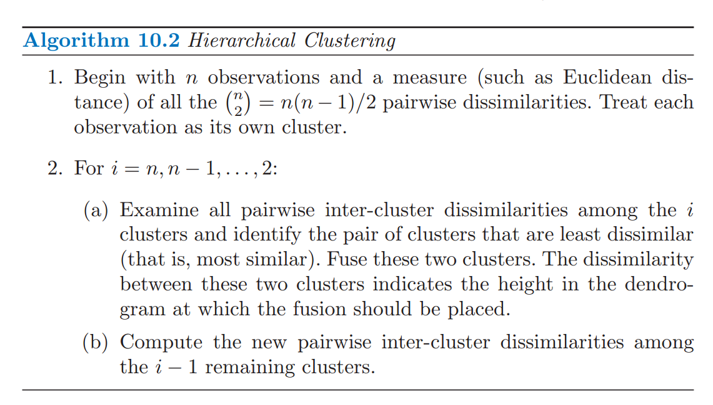
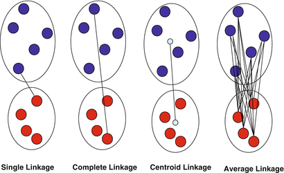
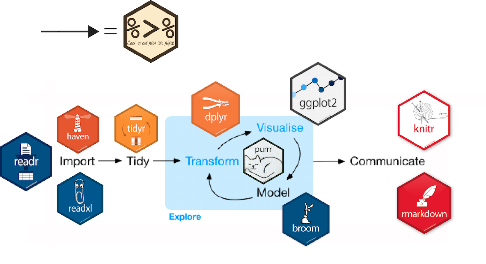

```{r setup, include=FALSE}
rm(list = ls())
knitr::opts_chunk$set(cache = TRUE, fig.align = 'center')
.packages <- c("ggplot2", "dplyr")
sapply(.packages, require, character.only = TRUE)
theme_set(theme_bw())
theme_update(text = element_text(size = 30))
```

## Contents

<div class="left", style="width: 50%">
* What is unsupervised learning?

* Dimensionality reduction with PCA
    
* Cluster Analysis:
    + k-means Clustering
    + Hierarchical Clustering
    
* Course wrap-up

</div>

<div class="right", style="width: 50%">

</div>


# Unsupervised Learning

## Unsupervised Learning

* Deals with a task of **inferring latent (hidden) 
patterns and structures unlabeled data**.

* The goal is to understand the **relationships between
features or among observations**.

* There is only $X$ and no $Y$, i.e. there are **no special variables** 
such as response or output variables, and **no prespecified classes labels** 
for the observations. 


## 

* Unsupervised learning encompasses:
    + dimensionality reduction, manifold learning \
    *e.g. PCA, MDS, Isomap, Diffusion Map, t-SNE, Autoencoder*
    + clustering *e.g. k-means, hierarchical clustering, mixture models*
    + anomaly detection
    + latent variable models

</br>

* It can handle the tasks such as:
    + image segmentation,
    + image clustering / automatic labeling,
    + visualization of high dimensional data *e.g. gene expression*,
    + finding cell subtypes.

# Dimensionality Reduction

## Dimensionality Reduction

* Most of **modern datasets are high-dimensional** e.g. genetic 
sequencing, medical records, user internet activity data etc.
* DR or feature extraction methods **can reduce the number of variables.**
* The methods can be used to:
    + compress the data
    + remove redundant features and noise
    + increase accuracy of learning methods by avoiding over-fitting and
    [the curse of dimensionality](http://statweb.stanford.edu/~donoho/Lectures/AMS2000/Curses.pdf) 
* Common methods for dimensionality reduction include: PCA, CA, ICA, MDS, 
Isomaps, Laplacian Eigenmaps, tSNE, Autoencoder.


## Principal Component Analysis (PCA)

<div style="float: left; width: 45%">


</div>

<div style="float: left; width: 51%">

</div>

Source: [ESL Chapter 14](https://web.stanford.edu/~hastie/ElemStatLearn/)


## Maximal variance Projection

</br>

* For $X\in \mathbb{R}^{n \times p}$, $\tilde X  = (X - \bar X)$ is a centered data matrix. 
* PCA is **an eigenvalue decomposition of the sample covariance matrix**:

$$C = \frac{1}{n-1} \tilde X ^T \tilde X = \frac{1}{n-1} V \Sigma^2 V^T$$ 

* or (equivalently) **a singular value decomposition (SVD)** of $\tilde X$ itself:

$$\tilde X = U \Sigma V^T $$

In the above $U$ and $V$ are orthogonal matrices and 

$\Sigma$ is a diagonal matrix.

##

* The projection of X into the space of principal components  is 
called a **component scores**:

$$T = \tilde{X} V = U\Sigma V^T V = U\Sigma$$

</br>

* The weights of the variables in the PCA space, $V$, are called **loadings**.


## Dimensionality reduction with PCA

* PCA finds **a set of $p$ uncorrelated** directions (components)
that are **linear combinations of the original $p$ variables**.
* These components sequentially explain most of the variation 
remaining subsequently in the data.
* Reduction occurs when **the top $k < p$ components are kept and used
to represent** the original $p$-dimensional data.

* The $k$-dimensional approximation of $X$ is:

$$T_k = U_k D_k$$

where $U_k$ is a matrix with $k$ first columns of $U$ and 
$D_k$ is the diagonal matrix containing first $q$
diagonal terms of $D$


## The US crime rates dataset

The built in dataset includes information on violent crime rates
in the US in 1975.

```{r}
head(USArrests)
```

Mean and standard deviation of the crime rates across all states:
```{r}
apply(USArrests, 2, mean)
apply(USArrests, 2, sd)
```

## PCA in R

* In R, the function `prcomp()` can be used to perform PCA. 
* `prcomp()` is faster and preferred method over `princomp()`; it is a PCA 
implementation based on SVD.

```{r}
pca.res <- prcomp(USArrests, scale = TRUE)
```

* The output of `prcomp()` is a list containing:

```{r}
names(pca.res)
```

##

The elements of `prcomp` output are:

* The principal components/scores matrix, $T = U\Sigma$ with projected samples coordinates.

```{r}
head(pca.res$x)
```

These are the sample coordinates in the PCA projection space.

##

* The principal axes matrix, $V$, contains the eigenvectors of the covariance
matrix. A related matrix of **loadings** is a matrix of eigenvectors scaled by 
the square roots of the respective eigenvalues: 

$$L = \frac{V \Sigma}{\sqrt{n-1}}$$ 

The loadings or principal axes give the weights of the variables in each of
the principal components.

```{r}
pca.res$rotation
```

##

```{r}
pca.res$rotation
```

</br> 

* PC1 places similar weights on `Assault`, `Murder`, 
and `Rape` variables, and a much smaller one on `UrbanPop`. Therefore,
**PC1 measures an overall measure of crime**.
* The 2nd loading puts most weight on `UrbanPop`. Thus,
**PC2 measures a level of urbanization**.
* The crime-related variables are **correlated** with each other, 
and therefore are close to each other on the biplot.
* `UrbanPop` is **independent** of the crime rate, and so 
it is further away on the plot.


##

* The standard deviations of the principal components 
(**square roots of the eigenvalues** of $\tilde X^T \tilde X$)

```{r}
pca.res$sdev
```

* The centers of the features, used for shifting:

```{r}
pca.res$center
```

* The standard deviations of the features, used for scaling:

```{r}
pca.res$scale
```


## Scree plot

<div class="left", style = "text-align: left; width: 50%">
* A scree plot can be used to choose how many components to retain.

* Look for **"elbows"** in the scree plots 

* Discard the dimensions with corresponding eigenvalues or equivalently 
**the proportion of variance explained** that drop off significantly. 

</div>

<div class="right", style = "text-align: right; width: 50%">
```{r}
# PCA eigenvalues/variances:
(pr.var <- pca.res$sdev^2)
plot(pca.res)
```
</div>


##

* Percent of variance explained:

```{r}
# install.packages("factoextra")
library(factoextra)

# Percent of variance explained:
(pve <- 100*pr.var/sum(pr.var))
fviz_eig(pca.res) + theme(text = element_text(size = 20))
```


## Samples Plot

Each principal component loading and score vector is **unique, up to a sign 
flip**. So another software could return this plot instead:

```{r}
fviz_pca_ind(pca.res) + coord_fixed() + 
    theme(text = element_text(size = 20))
```


## Features Plot


<div class="left", style = "width: 50%">

```{r, message=FALSE}
fviz_pca_var(pca.res) + coord_fixed() +
    theme(text = element_text(size = 20))
```
</div>

<div class="right", style = "width: 50%">

```{r}
fviz_contrib(pca.res, choice = "var", axes = 1) +
    theme(text = element_text(size = 20))
```

</div>

## Biplot

A biplot allows information on both samples and variables of a data matrix to 
be displayed at the same time.

```{r}
fviz_pca_biplot(pca.res) + coord_fixed() +
    theme(text = element_text(size = 20))
```


## Exercise

</br>

- Go to the "Lec8_Exercises.Rmd" file, which can be downloaded
from the class website under the Lecture tab.

- Complete Exercise 1.


# Cluster Analysis

## Cluster Analysis

* **Clustering is an exploratory technique** which can 
**discover hidden groups** that are important for understanding the data.

* Groupings are determined from the data itself, 
**without any prior knowledge about labels or classes**.

* There are the clustering methods available; a lot of them have an R 
implementation available on 
[CRAN](https://cran.r-project.org/web/views/Cluster.html).

<div style="text-align: center">

</div>

##

* To cluster the data we need a **measure of similarity** or
**dissimilarity** between a pair of observations, e.g.  an Euclidean distance.

<div style="text-align: center; height: 75%">

</div>

## k-means

* k-means is a simple and fast **iterative relocation method** 
for clustering data into $k$ distinct non-overlapping groups. 
* The algorithm minimizes the variation within each cluster.

<div style="height: 30%; width: 50%">

Source: [link](http://shabal.in/visuals/kmeans/3.html)
</div>

## k-means drawbacks

* **The number clusters $k$ must be prespecified** (before clustering).

* The method is stochastic, and involves **random initialization of
cluster centers**.

* This means that each time the algorithm is run, the results obtained
can be different.

The number of clusters, $k$, should be chosen using statistics such as:

* Gap Statistic [link](http://www.web.stanford.edu/~hastie/Papers/gap.pdf)

* Silhouette statistic [link](https://en.wikipedia.org/wiki/Silhouette_(clustering))

* Calinski-Harbasz index [link](http://www.biomedcentral.com/content/supplementary/1477-5956-9-30-S4.PDF)


## Image segmentation

* One of the application of k-means clustering is 
[**image segmentation**](https://www.r-bloggers.com/r-k-means-clustering-on-an-image/).

* Here we use a picture of a field of tulips in the Netherlands
downloaded from [here]("http://www.infohostels.com/immagini/news/2179.jpg").

<div style="text-align: center; height: 75%">

</div>

## Importing image to R

* First, we download the image:
```{r}
library(jpeg)
url <- "http://www.infohostels.com/immagini/news/2179.jpg"
dFile <- download.file(url, "./Lecture8-figure/Image.jpg")
img <- readJPEG("./Lecture8-figure/Image.jpg") 
(imgDm <- dim(img))
```

* The image is a 3D array, so we will convert it to a data frame.

* Each row of the data frame should correspond a single pixel. 

* The columns should include the pixel location (`x` and `y`), 
and the pixel intensity in red, green, and blue ( `R`, `G`, `B`).

```{r}
# Assign RGB channels to data frame
imgRGB <- data.frame(
  x = rep(1:imgDm[2], each = imgDm[1]),
  y = rep(imgDm[1]:1, imgDm[2]),
  R = as.vector(img[,,1]),
  G = as.vector(img[,,2]),
  B = as.vector(img[,,3])
)
```


## k-means in R

* Each pixel is a datapoint in 3D specifying the intensity in each of 
the three "R", "G", "B" channels, which determines the pixel's color.

```{r}
head(imgRGB, 3)
```


* We use k-means to cluster the pixels $k$ into color groups (clusters). 
* k-means can be performed in R with `kmeans()` built-in function.

```{r}
# Set seed since k-means involves a random initialization
set.seed(43658)
k <- 2
kmeans.2clust <- kmeans(imgRGB[, c("R", "G", "B")], centers = k)
names(kmeans.2clust)
```

##

```{r}
# k cluster centers
kmeans.2clust$centers
# The centers correspond to the following colors:
rgb(kmeans.2clust$centers)
# Cluster assignment of the first 10 pixels
head(kmeans.2clust$cluster, 10)
# Convert cluster assignment lables to cluster colors
kmeans.2colors <- rgb(kmeans.2clust$centers[kmeans.2clust$cluster, ])
head(kmeans.2colors, 10)
```


##

```{r}
ggplot(data = imgRGB, aes(x = x, y = y)) + 
  geom_point(colour = kmeans.2colors) +
  labs(title = paste("k-Means Clustering with", k, "clusters (colors)")) +
  xlab("x") + ylab("y") + theme_bw()
```

##

Now add more colors, by increase the number of clusters to 6:

```{r}
set.seed(348675)
kmeans.6clust <- kmeans(imgRGB[, c("R", "G", "B")], centers = 6)
kmeans.6colors <- rgb(kmeans.6clust$centers[kmeans.6clust$cluster, ])
```

```{r, echo = FALSE}
ggplot(data = imgRGB, aes(x = x, y = y)) + 
  geom_point(colour = kmeans.6colors) +
  labs(title = paste("k-Means Clustering with 6 clusters (colors)")) +
  xlab("x") + ylab("y") + theme_bw()
```


## Hierarchical clustering

<div style="height:10%; width:100%; float: center">

</div>
<small> Alexander Calder's mobile </small>

* If it's difficult (or if you simply
don't want) to choose the number of clusters ahead,
you can do **hierarchical clustering**.\

##

* Hierarchical clustering can be performed using agglomerative (bottom-up)
or divisive (top-down) approach.

* The method requires a choice of a pairwise distance metric and a rule
of how to merge or divide clusters.

* The output of the method can be represented as a graphical tree-based 
representation of the data, called a **dendogram**.

* The tree allows you to evaluate where the cutoff for grouping should occur.

##

<div style="float: left; width: 50%; height: 100%">


</div>

<div style="float: left; width: 50%; height: 100%">

</div>


## Hierarchical clustering algorithm



Source: [ISL](https://www-bcf.usc.edu/~gareth/ISL/)

## 

Results for hierarchical clustering differ depending on the choice of:

* A distance metric used for pairs of observations, e.g. Euclidean (L2), 
Manhattan (L1), Jaccard (Binary),
[etc](http://dataaspirant.com/2015/04/11/five-most-popular-similarity-measures-implementation-in-python/)

* The rule used for grouping clusters that are already generated, e.g. 
single (minimum), completer (maximum), centroid or average cluster linkages. 

</br>

<div class="center", style="width: 100%">

</div>

##
Different ways to compute dissimilarity between 2 clusters:


## Iris dataset

* We will use the Fisher's Iris dataset containing measurements on 150 irises.
* Hierarchical clustering will calculate the grouping of 
the flowers into groups corresponding. We will see that these groups
will roughly correspond to the flower species.

```{r}
head(iris)
```

## Hierarchical clustering in R

* Built-in function `hclust()` performs hierarchical clustering.
* We will use only the petal dimensions (2 columns) to compute
the distances between flowers.

```{r}
# We use the Euclidean distance for the dissimilarities between flowers
distMat <- dist(iris[, 3:4])


# We use the "complete" linkage method for computing the cluster distances.
clusters <- hclust(distMat, method = "complete")
```

##

```{r, fig.width=15, fig.height=9}
plot(clusters, cex = 0.7)
```


##

The dendrogram suggests that a reasonable choice of the number of clusters is
either 3 or 4.

```{r fig.width=12, fig.height=7}
plot(clusters, cex = 0.7)
abline(a = 2, b = 0, col = "blue")
abline(a = 3, b = 0, col = "blue")
```

## 

* We pick 3 clusters. 
* To get the assignments with 3 clusters from
the **truncated** tree we can use a `cutree()` function.

```{r}
(clusterCut <- cutree(clusters, 3))
```

```{r}
table(clusterCut, iris$Species)
```

##

```{r, fig.width=15, fig.height=9}
plot(clusters, labels = clusterCut, cex = 0.9)
rect.hclust(clusters, k = 3, border=c("red", "blue", "green"))
```


##

```{r}
table(clusterCut, iris$Species)
```

* From the table we see that the sentosa and virginica were correctly assigned to
separate groups. 
* However, the method had difficulty grouping the versicolorm flowers into a separate 
cluster.

##

Try another linkage method like "average" and see if it performs better.

```{r, fig.width=12, fig.height=7}
# We use the Euclidean distance for the dissimilarities between flowers
distMat <- dist(iris[, 3:4])
# We use the "complete" linkage method for computing the cluster distances.
clusters <- hclust(distMat, method = "average")
plot(clusters, cex = 0.5)
```

##

Here we can choose 3 or 5 clusters:
```{r fig.width=12, fig.height=7}
plot(clusters, cex = 0.6)
abline(a = 1.35, b = 0, col = "blue")
abline(a = 0.9, b = 0, col = "blue")
```

##

Again we choose 3 clusters

```{r}
clusterCut <- cutree(clusters, 3)
table(clusterCut, iris$Species)
```

We see that this time the results are better in terms of the cluster assignment
agreement with the flower species classification.

##

```{r, fig.width=15, fig.height=9}
plot(clusters, labels = clusterCut, cex = 0.7)
rect.hclust(clusters, k = 3, border=c("red", "blue", "green"))
```

##

* 2D plot of the iris dataset using petal dimensions as coordinates.
* The cluster assignments partition the flowers into 
species with high accuracy.

```{r fig.width=8, fig.height=6}
ggplot(iris, aes(Petal.Length, Petal.Width)) + theme_bw() +
  geom_text(aes(label = clusterCut), vjust = -1) + 
  geom_point(aes(color = Species)) + coord_fixed(1.5)
```

## Exercise

</br>

- Go to the "Lec8_Exercises.Rmd" file, which can be downloaded
from the class website under the Lecture tab.

- Complete Exercise 2.


# Course wrap-up

## Our journey




## How to learn more

Where to find out more about the topics of this class:

- R for Data Science, by Hadley Wickham: (http://r4ds.had.co.nz)
- The tidyverse: (https://www.tidyverse.org)
- RStudio: (https://www.rstudio.com/)
- R Markdown: (http://rmarkdown.rstudio.com/)
- Many online tutorials and forums (e.g.
[Data Carpentry](https://datacarpentry.org/) and [DataCamp](https://www.datacamp.com/))

How to learn more advanced topics on R:

- Take “Stat 290: Computing for Data Science”
- Read “Advanced R”, by Hadley Wickham: (http://adv-r.had.co.nz/)
- Read “R packages”, by Hadley Wickham: (http://rpkgs.had.co.nz/)


# Extra: Other unsupervised techniques

## Multidimensional Scaling

> MDS algorithm aims to place each object in N-dimensional space such that 
the between-object distances are preserved as well as possible. Each object 
is then assigned coordinates in each of the N dimensions. The number 
of dimensions of an MDS plot N can exceed 2 and is specified a priori. 
Choosing N=2 optimizes the object locations for a two-dimensional scatterplot.

There are different types of MDS methods including, **Classical MDS**,
**Metric MDS** and **Non-metric MDS**. The details on the differences
ca be found on:

* [Wiki](https://en.wikipedia.org/wiki/Multidimensional_scaling) page on Multidimensional Scaling,
* Chapter 8 of [Applied Multidimensional Scaling](http://www.springer.com/us/book/9783642318474)
book by Borg, Groenen, and Mair.


## Perception of colors

* Gosta Ekman studied how people perceive colors in 
[his paper from 1954](http://www.tandfonline.com/doi/abs/10.1080/00223980.1954.9712953). 
* He collected survey data from 31 subjects, which included participants' rating
of the dissimilarity between each pair of 14 colors on a 5-point scale. 
* The ratings of all subjects were averaged, and the final mean dissimilarity 
matrix was used for constructing "map of colors".

##

14 colors were studied with wavelengths in the range between 434 and 674 nm.

<div style="text-align: center">

</div>


##

```{r}
# color similarity scores 
ekmanSim <- readRDS("./Lecture8-figure/ekman.rds")
print(ekmanSim)
# convert similarities to dissimilarities
ekmanDist <- 1 - ekmanSim
```

## MDS in R

* Use `cmdscale()` built-in function for classical MDS. 
* Metric iterative MDS and non-metric MDS function are available in a
package `smacof` and other packages are also compared 
[here](http://gastonsanchez.com/how-to/2013/01/23/MDS-in-R/).

```{r}
ekmanMDS <- cmdscale(ekmanDist, k = 2)
res <- data.frame(ekmanMDS)
head(res)
```

##

```{r fig.height=4.5, fig.width=5}
library("ggplot2")
wavelengths <- round(seq( 434, 674, length.out = 14))
res$wavelength <- factor(wavelengths, levels =wavelengths)
ggplot(res, aes(X1, X2)) + geom_point() + theme_bw() +
  geom_text(aes(label = wavelength), vjust=-1)
```

##

The wavelengths were converted to hexadecimal colors using this 
[website](https://academo.org/demos/wavelength-to-colour-relationship/). 
```{r}
hex <- c("#2800ff", "#0051ff", "#00aeff", "#00fbff", "#00ff28", "#4eff00", "#92ff00", 
          "#ccff00", "#fff900", "#ffbe00", "#ff7b00", "#ff3000", "#ff0000", "#ff0000")
ggplot(res, aes(X1, X2)) + theme_bw() +
  geom_point(aes(color = wavelength), size = 2) + 
  geom_text(aes(label = wavelength), vjust=-1) +
  scale_color_manual(values = hex)
```


## t-Distributed Stochastic Neighbor Embedding

* t-SNE is a **nonlinear** technique developed by 
[van der Maaten and Hinton](https://lvdmaaten.github.io/tsne/)
for dimensionality reduction 
* It is particularly well suited for the visualization of high-dimensional 
datasets.
* The method performs well at visualizing and exposing inherent data clusters
* It has been widely applied in many fields including genomics, where
the method is commonly used in single-cell literature for visualizing 
cell subpopulations.


## tSNE on mass cytometry data

The following example shows how to calculate and plot a 2D t-SNE projection
using the `Rtsne` package. The example and code was developed by
[Lukas Weber](https://github.com/lmweber/Rtsne-example).

* The dataset used is the mass cytometry of healthy human bone marrow dataset 
from the study conducted by [Amir et al. (2013)]( http://www.ncbi.nlm.nih.gov/pubmed/23685480). 
* Mass cytometry measures the expression levels of up to 40 proteins 
per cell and hundreds of cells per second.
* In this example t-SNE is very effective at displaying groups
of different cell populations (types).

##


```{r}
#  here we use a subset of the data
path <- "./Lecture8-figure/healthyHumanBoneMarrow_small.csv"
dat <- read.csv(path)
```


```{r}
# We select 13 protein markers to used in Amir et al. 2013
colnames_proj <- colnames(dat)[c(11, 23, 10, 16, 7, 22, 14, 28, 12, 6, 8, 13, 30)]
dat <- dat[, colnames_proj]      
head(dat)
```

##

```{r}
# arcsinh transformation 
# (see Amir et al. 2013, Online Methods, "Processing of mass cytometry data")
asinh_scale <- 5
dat <- asinh(dat / asinh_scale)  
# prepare data for Rtsne
dat <- dat[!duplicated(dat), ]  # remove rows containing duplicate values within rounding
dim(dat)
```

```{r}
library(Rtsne)
# run Rtsne (Barnes-Hut-SNE algorithm) without PCA step 
# (see Amir et al. 2013, Online Methods, "viSNE analysis")
set.seed(123)  
rtsne_out <- Rtsne(as.matrix(dat), perplexity = 20,
                   pca = FALSE, verbose = FALSE)
```

##

```{r}
# plot 2D t-SNE projection
plot(rtsne_out$Y, asp = 1, pch = 20, col = "blue", 
     cex = 0.75, cex.axis = 1.25, cex.lab = 1.25, cex.main = 1.5, 
     xlab = "t-SNE dimension 1", ylab = "t-SNE dimension 2", 
     main = "2D t-SNE projection")
```


