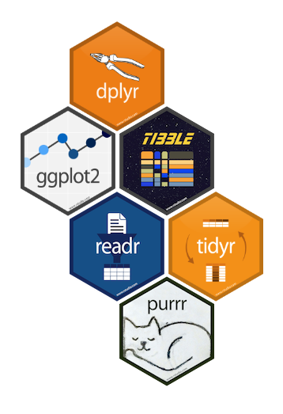

```{r setup, include=FALSE}
knitr::opts_chunk$set(echo = TRUE)
```

## When should you use R?

- R can be used for **data analysis and visualization**. 

> - It provides efficient **exploration and prototyping** tools, 
but also offers powerful frameworks for **building and fitting statistical models**.

> - R is very good when working with **data that fits in the computer’s memory**.

> - It’s NOT as good for working with massive datasets whose elements 
need to be continuously accessed.

## Special values in R 

Some words are **reserved** in `R` and cannot be used as oject/variable/function names:

- `Inf` and `–Inf` which respectively stand for positive and negative infinity. 
R will returnm this value if results are numbers that are too big.

```{r} 
2^1024 
-1/0 
``` 

- `NULL` denotes a null object and is often used as a default value of 
an argument in a function definition, e.g.: 

```{r} 
f1 <- function(arg1, arg2 = NULL) { 
  print(paste("Argument 1 is:", arg1)) 
  if(!is.null(arg2)) 
    print(paste("Argument 2 is:", arg2)) 
} 
``` 


## Special values in R 

- `NA` represents a missing value ("not available"). 
```{r} 
v <- c(1,2,3) 
length(v) <- 4 

# R automatically fills a NA into the end of `v` as no value is provided.
v 
``` 

- `NaN` means ‘Not a Number’, and can result from a computation that is undefined:

```{r} 
0/0 
1/0 - 1/0 
``` 


## `tidyverse`

<div class="left", style="width: 65%;"> 
  
  From https://www.tidyverse.org/:
  
  > The `tidyverse` is an opinionated collection of R packages designed for data 
science. All packages share an underlying design philosophy, grammar, and data 
structures. 

The system is intended to make data scientists more productive. To use
`tidyverse` do the following:
  
  ```{r, eval = FALSE}
# Install the package
install.packages("tidyverse")
# Load it into memory
library("tidyverse")
```
</div>
  
  <div class="right", style="width: 35%;"> 
  </img> 
</div>
  
## Data science workflow


##

```{r}
sessionInfo()
```

